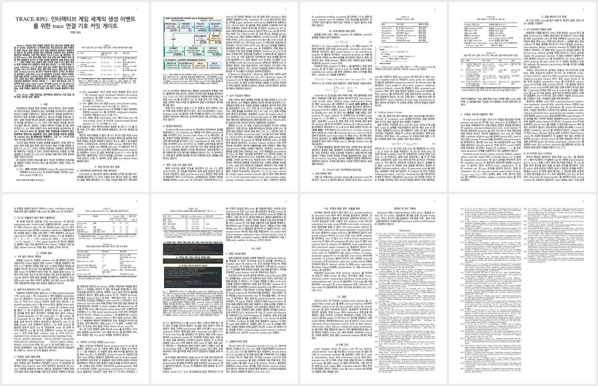
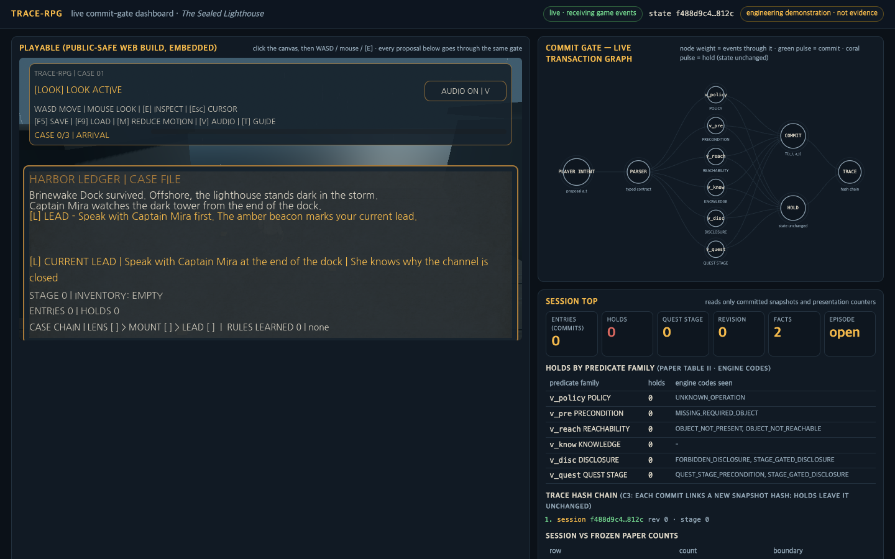

# TRACE-RPG — The Sealed Lighthouse

[English](README.md) | **한국어**

*언어 모델은 게임 세계에서 다음에 무슨 일이 일어날지 제안할 수 있다. 하지만 결정론적 symbolic commit gate가 허락하기 전까지 그 무엇도 정식 상태가 되지 않으며, 모든 결과는 hash로 연결된 영수증을 남긴다.*

[](https://github.com/akillness/neural_symbolic_in_game/actions/workflows/validate.yml)
[](neuro-symbolic-interactive-game-research-2026/paper/latex/en/main.pdf)
[](neuro-symbolic-interactive-game-research-2026/paper/latex/ko/main.pdf)
[](https://sealed-lighthouse-trace-rpg.vercel.app)
[](https://sealed-lighthouse-trace-rpg.vercel.app/public/)
[](neuro-symbolic-interactive-game-research-2026/game-track/godot/README.ko.md)
[](neuro-symbolic-interactive-game-research-2026/pyproject.toml)
[](neuro-symbolic-interactive-game-research-2026/game-track/godot/docs/latest/evaluation-matrix.md)
[](https://github.com/akillness/neural_symbolic_in_game/commits/main)
[](neuro-symbolic-interactive-game-research-2026/docs/slides/trace-rpg-overview.ko.html)


- **Gate.** 생성된 모든 이벤트는 신뢰할 수 없는 transaction proposal로 취급한다. type-strict parser, 외부 action policy, 그리고 여섯 상태 상대 계열에 속한 일곱 개의 결정론적 검사가 commit 여부를 결정한다. 거부된 candidate는 한도 내에서 반례 유도 repair를 받고, 그 밖의 모든 경우는 변경 없는 이전 상태로 되돌아간다.
- **게임.** *The Sealed Lighthouse*는 Godot 4.7.1로 만든 턴제 수사 micro-RPG다. 게임 안의 ledger가 gate를 서사 속에서 그대로 보여 준다. hold는 자신을 막은 계열을 명시하고 규칙을 가르치며, commit은 기여를 게시하고 다음 단서를 열고 SHA-256 영수증 체인을 잇는다.
- **근거, 그리고 그 한계.** 네 개의 레인(E1 오프라인 fixture, E2 라이브 스크리닝, E3 KG 시뮬레이션, ENG1 엔진 적합성)은 정확한 count만 보고한다. gate 일치 13/13, guided-repairable class에서 ρ 5/5, 플레이어블 검사 52/52, 하나로 일치하는 종단 state hash. 작성된 세계 하나, hosted proposer 하나, 참가자 없음, 효능 주장 없음.

## 논문 한눈에 보기


**TRACE-RPG: A Trace-Linked Symbolic Commit Gate for Generated Events in an Interactive Game World.** 익명 심사를 위해 제출한 원고(IEEE Transactions on Games short-paper 밴드 6–8쪽; EN·KO 원고는 각 8쪽으로 같은 구조를 공유). 참고문헌 55건은 모두 해석 가능성과 인용 맥락 적합성을 다시 검증했다.

**논지.** 유창하거나 schema에 맞는 생성 텍스트는 제안된 게임 이벤트가 실행 가능하고, 승인되었으며, 정식 상태와 일관된다는 것을 보장하지 않는다. 그래서 TRACE-RPG는 생성된 모든 이벤트를 신뢰할 수 없는 transaction proposal로 취급하고, 결정론적 symbolic commit gate를 통해서만 받아들인다.

| | 기여 | 무엇을 보장하는가 |
|---|---|---|
| **C1** | 신뢰 경계 contract와 type-strict parser | 알 수 없는 key와 모호한 type을 proposal 경계와 replay 경계 양쪽에서 거부한다 |
| **C2** | validate–repair–commit controller | 여섯 상태 상대 계열의 일곱 개의 결정론적 검사, 한도 내 repair(기록되는 시도는 최대 K+1회), 변경 없는 fallback, commit 전 재검증 |
| **C3** | 감사 연결 근거 계층 | SHA-256으로 연결된 record, 상태 의미 replay, assignment-complete 회계 |
| **C4** | assignment-complete harness | 설계된 사례를 하나도 빠짐없이 관찰하고 분류하는 정확한 회계 |
| **C5** | 반례 유도 repair 연산자 ρ | 직전 candidate와 validator의 typed error set만 읽으며, 권위 있는 상태는 절대 읽지 않는다 |

일곱 검사는 여섯 상태 상대 계열로 묶인다. 어떤 실패도 상태를 바꾸지 않는다.

| 계열 | 검사 | 거부하는 것 |
|---|---|---|
| Action policy | 1 | 알 수 없는 action 또는 type |
| Precondition | 2 | 없거나 거짓인 요구 조건 |
| Reachability | 3 | 접근 불가능한 object |
| NPC knowledge | 4 | 선언되지 않은 known fact |
| Disclosure | 5 | 금지된 fact |
| Quest | 6, 7 | 자격 없는 stage; stage 후퇴 |

[](neuro-symbolic-interactive-game-research-2026/paper/latex/ko/main.pdf)

## 근거

네 개의 레인, 네 개의 상한. 모든 숫자는 결정론적 runner 또는 hash로 묶인 영수증에서 나온 raw count이며, 추론 통계는 보고하지 않는다.

| 레인 | 설계 | 단위 | 대표 count | 상한 |
|---|---|---|---|---|
| **E1** 오프라인 적합성 | 작성된 frozen fixture, 세계 하나: gate fixture 13개, repair fixture 12개 × 4 arm, fault injection 10개, adapter/회계 assignment 7개, guard 3개 | Fixture | gate 일치 13/13; guided-repairable class에서 ρ 5/5 | 인코딩된 술어에 대한 mechanism 적합성 — 효능 아님 |
| **E2** 라이브 스크리닝 | hosted proposer 하나(`gpt-5.6-sol`), 5 cell × 5 call, K = 1, 두 arm에 동일 candidate | Call | Signal-v2 cell: ρ 5/5 대 blind retry 0/5 | pilot-only; 모집단·모델 순위 주장 없음 |
| **E3** KG/온톨로지 시뮬레이션 | closed-world typed-link 시뮬레이션: node 43개, reference edge 106개, 검토된 typed edge 24개, 채점된 proposal 210개; degree baseline 대 고정 전략 6개 | Proposal | 작성된 holdout 6/6 회수 | simulation-only; 런타임 검색이나 의미적 진리 아님 |
| **ENG1** Godot/Web 엔지니어링 | fixture 4개, 검사 52개, 8항목 3D 스모크, archetype 회전 5회 | Check | 52/52 · 8/8 · 5/5; 종단 hash가 오프라인 runner와 일치 | 성능이 아닌 적합성; 참가자 없음 |

**결과 전문.**

- **E1.** gate 일치 13/13, 구현된 error code 12개 모두 관찰. 처음에 invalid였던 repair 사례 12건(guided-repairable 5 / oracle-only 1 / irreparable 6)에 대해 rejection-only 0/12, blind retry 0/12, ρ 5/5 + 0/1 + 0/6, 상태를 읽는 oracle callback 5/5 + 1/1 + 0/6. 실패한 모든 arm은 상태를 그대로 두었다. 사전 지정된 fault 10/10이 지정된 검사에서 거부되었다. provenance 경계 fixture 1/1은 설계상 replay를 통과한다 — key 없는 hash는 무결성을 주지 인증을 주지 않는다.
- **E2.** guided의 우위는 policy-blind Signal-v2 cell에서만 나타났다(ρ 5/5 대 blind 0/5, +5). 나머지 네 cell은 +0이었다. 세 건은 candidate가 이미 valid였고, 한 건은 되돌릴 수 없는 quest-stage 후퇴였다. 비-commit 결과 15/15 모두 이전 상태 hash를 보존했다.
- **E3.** typed-lexical 전략이 작성된 holdout 6/6을 회수했다(P = R = F1 = 1.000, MRR 0.944, Brier 0.131, Sem@3 1.000). degree baseline은 하나도 회수하지 못했다.
- **ENG1.** Godot slice가 작성된 trace를 replay하며 종단 state hash가 오프라인 runner와 동일하다: `4b2310173dc059071fdc98e7705608d383dda81559706c3dd33bc96983108892`. 플레이어블 평가 52/52(fixture 검사 40 + presentation invariant 12), 3D 스모크 8/8, balance probe 5/5.


**이 근거가 보여 주지 않는 것.**

- 어떤 모델이 다른 모델보다 낫다는 것 — E2는 revision이 고정되지 않은 hosted proposer 하나로 cell당 다섯 번 호출했다.
- 플레이어 경험, 재미, usability, 정서 — 참가자를 모집한 적이 없다.
- 작성된 세계 하나를 넘어서는 일반화 — 모든 fixture는 frozen world state 하나 안에 있다.
- 작성자 인증 — hash 체인은 key가 없으므로 무결성만 증명한다.
- 엔진 성능 — ENG1은 적합성 근거이지 지연이나 처리량 근거가 아니다.

## 게임

*The Sealed Lighthouse*는 3D 항구 장면 안의 턴제 서사 수사 micro-RPG다(Godot 4.7.1, 영어 UI). 보상은 항구 쪽 신호를 복구하고 저조 항로를 얻는 것이며, 바다 건너 등대 자체는 봉인된 채 어둡게 남는다. 브라우저에서 바로 플레이할 수 있다: [sealed-lighthouse-trace-rpg.vercel.app](https://sealed-lighthouse-trace-rpg.vercel.app)은 게임이 임베드된 라이브 대시보드를 열고, [`/public/`](https://sealed-lighthouse-trace-rpg.vercel.app/public/)은 게임만 연다.

**골든 패스** — commit 세 번, 선택적으로 hold 한 번:

1. 램프 창고에서 신호 렌즈를 회수 → **commit**, stage 0 > 1.
2. 항구 신호 mount에 렌즈를 설치 → **commit**, stage 1 > 2, 단서가 승인된다.
3. Mira 선장에게 조석 표식 단서를 요청 → **commit**; 이어서 서쪽 방파제의 조석 표식을 조사 → 에피소드 완료.
4. (선택) Mira에게 봉인된 등대지기의 비밀을 요청 → DISCLOSURE 계열이 **HELD**, 상태 변경 없음, 규칙 학습.

**플레이어가 읽는 ledger** — commit된 snapshot의 presentation 전용 readout이며, oracle label이나 봉인된 fact는 절대 담지 않는다:

```text
[P] PROPOSAL …
[C] ENTRY #N | COMMITTED
[C] CONTRIBUTION #N | <facts> | STAGE a>b | CHAIN k/3
[N] UNLOCKED | <next affordance>

[H] HELD | [V] GATE <family> | state unchanged
[N] NEXT VALID ENTRY
[V] RULE LEARNED | <family>: <rule>

HUD      CASE CHAIN | LENS [x] > MOUNT [x] > LEAD [x] | RULES LEARNED n
End card INVESTIGATOR'S CONTRIBUTION #1–#3 · RULES LEARNED · ENTRIES/HOLDS/FINAL STAGE
         VALIDATOR RECEIPT <state hash> · HOLDS BY GATE
```

| 키 | 동작 | | 키 | 동작 |
|---|---|---|---|---|
| `W A S D` | 이동 | | `F5` / `F9` | 저장 / 불러오기(checksum 검증; 손상된 save는 거부) |
| 마우스 | 시점 | | `M` | 모션 줄이기 |
| `E` | 상호작용 / 조사 | | `V` | 오디오 토글 |
| `Esc` | 커서 해제 | | `T` | 필드 가이드 |

<table>
  <tr>
    <td></td>
    <td></td>
  </tr>
  <tr>
    <td align="center"><sub>Hold — gate가 자신의 계열을 명시한다</sub></td>
    <td align="center"><sub>Commit — 기여와 다음 affordance</sub></td>
  </tr>
  <tr>
    <td></td>
    <td></td>
  </tr>
  <tr>
    <td align="center"><sub>End card — 두 부분으로 된 영수증</sub></td>
    <td align="center"><sub>브라우저의 Web 빌드</sub></td>
  </tr>
</table>

<p align="center">
  
  
</p>

위 캡처는 모두 추적되는 1280×720 엔지니어링 캡처이지 usability 근거가 아니다. 플레이어블의 UI 아트는 파일별 provenance와 절차적 fallback을 갖춘 큐레이션된 AI 생성 이미지(Higgsfield)이고, 플레이어 rig는 큐레이션된 Higgsfield GLB(Idle / Casual_Walk)이며, Mixamo 원본 파일은 절대 추적하지 않는다. 이동, 카메라, VFX, 오디오, UI는 정식 상태를 바꾸지 않는다. 바꾸는 것은 proposal router와 validator뿐이며, 엔진 slice에는 라이브 Python 왕복이 없다.

## 라이브 commit-gate 대시보드


<table>
  <tr>
    <td></td>
    <td></td>
  </tr>
  <tr>
    <td align="center"><sub>Hold</sub></td>
    <td align="center"><sub>Commit</sub></td>
  </tr>
  <tr>
    <td></td>
    <td></td>
  </tr>
  <tr>
    <td align="center"><sub>에피소드 완료</sub></td>
    <td align="center"><sub>패널</sub></td>
  </tr>
</table>

**라이브:** [sealed-lighthouse-trace-rpg.vercel.app](https://sealed-lighthouse-trace-rpg.vercel.app) — 프로덕션 사이트 루트는 `/dashboard/`로 리다이렉트되고, 임베드된 게임은 `/public/`에서 서빙된다(2026-09-03 `scripts/deploy_vercel_dashboard.sh`로 배포; 데스크톱과 390×844 뷰포트에서 콘솔·페이지 오류 0).

<p align="center"></p>

로컬에서 실행하려면, 대시보드가 로컬 Web 빌드를 내장하므로 로컬에서 서빙한다:

```bash
cd neuro-symbolic-interactive-game-research-2026
./scripts/build_godot_web.sh                                   # disposable-copy Web export -> game-track/web/public/ (ignored)
python3 -m http.server 4173 --bind 127.0.0.1 --directory game-track/web
open http://127.0.0.1:4173/dashboard/                          # game at /public/, dashboard at /dashboard/
```

경계는 한 방향이다. 게임은 내장되었을 때만 `window.parent.postMessage`로 typed event를 미러링하고, 페이지에는 게임으로 되돌아가는 채널이 없으며 봉인된 fact ID를 절대 받지 않는다. 녹화된 경로는 commit 3회와 hold 1회(`FORBIDDEN_DISCLOSURE` → DISCLOSURE 계열)를 만들었고, hash 체인은 `f488d9c4…812c → 19b474dc…c498 → 93381457…b900 → 4b231017…8892`다.

## 슬라이드

16장짜리 한국어 개요 덱을 단일 HTML 파일로 제공한다: [`trace-rpg-overview.ko.html`](neuro-symbolic-interactive-game-research-2026/docs/slides/trace-rpg-overview.ko.html)(화살표나 스페이스로 이동, `?`로 도움말). 덱은 이 README와 같은 흐름을 따른다.

<table>
  <tr>
    <td><br><sub>01 · 제목</sub></td>
    <td><br><sub>02 · 문제: 유창한 텍스트 ≠ valid한 이벤트(여섯 가지 실패 유형)</sub></td>
    <td><br><sub>03 · 은행 창구 비유</sub></td>
    <td><br><sub>04 · 파이프라인: propose → parse → policy → 7 검사 / 6 계열 → repair 또는 fallback → commit → record → replay</sub></td>
  </tr>
  <tr>
    <td><br><sub>05 · 여섯 상태 상대 계열, 일곱 검사, 게임 예시</sub></td>
    <td><br><sub>06 · Guided repair: ρ 루프와 네 개의 arm</sub></td>
    <td><br><sub>07 · SHA-256 영수증 체인과 의미 replay</sub></td>
    <td><br><sub>08 · 기여 C1–C5</sub></td>
  </tr>
  <tr>
    <td><br><sub>09 · 근거 레인 E1 / E2 / E3 / ENG1과 상한</sub></td>
    <td><br><sub>10 · 오프라인 repair-arm 막대 그래프</sub></td>
    <td><br><sub>11 · 라이브 스크리닝 표와 KG 숫자</sub></td>
    <td><br><sub>12 · 게임 에피소드 루프와 권위 경계</sub></td>
  </tr>
  <tr>
    <td><br><sub>13 · 규칙 학습으로서의 HELD 화면</sub></td>
    <td><br><sub>14 · 기여 readout: CONTRIBUTION / UNLOCKED / CASE CHAIN과 두 부분 영수증</sub></td>
    <td><br><sub>15 · 근거가 말하는 것과 말하지 않는 것</sub></td>
    <td><br><sub>16 · 다음 단계와 세 줄 요약</sub></td>
  </tr>
</table>

## 재현

```bash
cd neuro-symbolic-interactive-game-research-2026
uv sync                                              # Python 3.11+
uv run python -m pytest -q                           # unit + contract tests
uv run python scripts/validate_project.py            # structure, schemas/bridge, SVG, evidence contracts
uv run python scripts/validate_contribution_crosswalk.py
uv run python scripts/validate_visual_assets.py --require-pdf-tools
./scripts/validate_game_track.sh                     # Godot 4.7.1 on PATH: fixtures, smoke, balance probe
uv run python scripts/run_playable_evaluation.py     # SL-PLAY-EVAL-001 on a disposable project copy
./scripts/verify_like_ci.sh                          # the CI-equivalent gate
make -C paper/latex check                            # EN (pdflatex) + KO (xelatex) PDFs, page band, Type 3 check
```

- `uv sync` — lock된 Python 3.11+ 환경을 설치한다.
- `pytest` — parser, validator, repair, replay, 무결성, 회계 contract.
- `validate_project.py` — 저장소 구조, JSON 스키마와 game bridge, SVG 원본, 소스 매니페스트, 증거·분석 계약.
- `validate_contribution_crosswalk.py` — C1–C5, 참고문헌 55건, 근거 레인 네 개가 두 원고에서 서로 일관되는지.
- `validate_visual_assets.py` — 논문의 모든 그림과 표가 편집 가능한 원본과 데이터로 이어지는지.
- `validate_game_track.sh` — Godot fixture, 3D 스모크, archetype balance probe.
- `run_playable_evaluation.py` — 프로젝트의 일회용 복사본 위에서 SL-PLAY-EVAL-001(검사 52개).
- `verify_like_ci.sh` — `validate` workflow가 실행하는 것과 같은 gate.
- `make -C paper/latex check` — 두 PDF를 다시 빌드하고 쪽수 밴드와 Type 3 font 회귀를 거부한다.

패킷: 오프라인 파일럿(frozen, hash로 묶임)은 [`research/academic-pipeline/stage-04-pilot/`](neuro-symbolic-interactive-game-research-2026/research/academic-pipeline/stage-04-pilot/), 라이브 스크리닝은 [`research/academic-pipeline/rq2-live-pilot/`](neuro-symbolic-interactive-game-research-2026/research/academic-pipeline/rq2-live-pilot/), KG 시뮬레이션은 [`research/simulation/kg-ontology/`](neuro-symbolic-interactive-game-research-2026/research/simulation/kg-ontology/), 플레이어블 평가는 [`game-track/godot/docs/latest/`](neuro-symbolic-interactive-game-research-2026/game-track/godot/docs/latest/).

## 경계와 공개

논문이 명시하는 경계이며, 이 README도 같은 경계를 지킨다:

- 작성된 세계 하나. 모든 fixture와 플레이어블은 frozen world state 하나를 공유한다.
- revision이 고정되지 않은 hosted proposer 하나. 라이브 스크리닝은 pilot-only다.
- 참가자 없음, 정서·usability 데이터 없음, 효능 주장 없음.
- key 없는 hash는 무결성을 주지 인증을 주지 않는다.
- 엔진 근거는 성능이 아닌 적합성이다.
- 사람이 판단하는 gate — G4(presentation), G6(production) — 는 아직 열려 있다.

**AI 공개.** 대규모 언어 모델이 산문·코드·테스트 초안 작성과 인용 확인을 도왔고, hosted 모델이 라벨이 붙은 라이브 스크리닝 candidate를 생성했다. 보고된 모든 count는 결정론적 runner 또는 hash로 묶인 영수증에서 나온다. 플레이어블의 UI 아트는 파일별 provenance와 절차적 fallback을 갖춘 큐레이션된 AI 생성 이미지(Higgsfield)이고, 플레이어 rig는 큐레이션된 Higgsfield GLB이며, Mixamo 원본 파일은 절대 추적하지 않는다.

License: to be announced.

## 인용

```bibtex
@misc{tracerpg2026,
  title = {TRACE-RPG: A Trace-Linked Symbolic Commit Gate for Generated Events in an Interactive Game World},
  year  = {2026},
  note  = {Manuscript under anonymous review},
  url   = {https://github.com/akillness/neural_symbolic_in_game}
}
```
