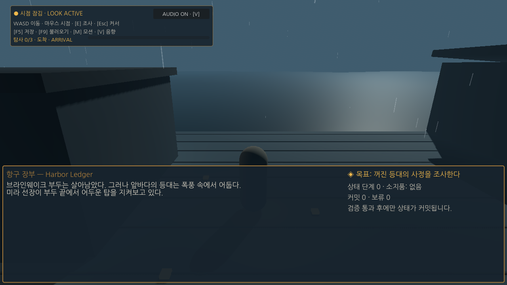
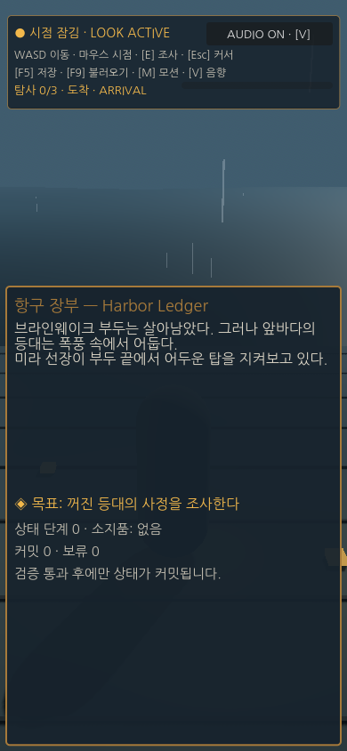

# Neural-Symbolic Interactive Game Research 2026

[](https://github.com/akillness/neural_symbolic_in_game/actions/workflows/validate.yml)
[](https://www.python.org/)
[](./llm-wiki/index.md)
[](./neuro-symbolic-interactive-game-research-2026/README.en.md)

도전적인 뉴로-심볼릭 인터랙티브 게임 연구를 위한 이중언어 논문 초안, 10개 모델 평가 매트릭스, 결정론적 정책 검증 런타임, semantic trace replay, recorded-response 실험 runner, 게임 브리지, 지속 갱신 가능한 연구 하네스입니다. 실제 모델/엔진 어댑터와 인간 실험은 다음 구현 단계입니다.

This repository contains a bilingual paper draft, a ten-model evaluation matrix, deterministic policy validation, semantic trace replay, a recorded-response experiment runner, a game bridge, and a refreshable research harness. Real model and engine adapters plus the human study remain future work.

| Start here | Description |
|---|---|
| [한국어 안내](./neuro-symbolic-interactive-game-research-2026/README.ko.md) | 연구 질문, 구조, 실행 순서 |
| [English guide](./neuro-symbolic-interactive-game-research-2026/README.en.md) | Research questions, architecture, execution |
| [한국어 논문 초안](./neuro-symbolic-interactive-game-research-2026/paper/ko/manuscript.md) | TRACE-RPG manuscript draft |
| [English paper draft](./neuro-symbolic-interactive-game-research-2026/paper/en/manuscript.md) | TRACE-RPG manuscript draft |
| [Project knowledge index](./llm-wiki/index.md) | Persistent sources, concepts, reports, and graph |

## 완료 상태 / Completion status

| 영역 / Area | 상태 / Status | 근거 / Evidence |
|---|---|---|
| 구현 / Implementation | **완료 / Done** | 120 tests, deterministic pilot incl. guided-repair arm, Godot 4.7.1 slice, live public-safe Web build |
| 학술 파이프라인 / Academic pipeline | **완료 / Done** | 10 stages executed; pilot packet 22 inputs + 38 artifacts, clean-tag re-lock at each release checkpoint |
| 논문 / Paper | **작성 완료 / Drafted** | Bilingual IEEE short paper, EN 8 pp / KO 7 pp, 45 verified references, ρ(a,E) guided-repair method |
| 재현성 / Reproducibility | **완료 / Done** | 120/120 tests; 38/38 artifact + 22/22 input hashes recompute from the frozen packet |
| **실험 / Experiments** | **미완료 / NOT DONE** | `C-RESULT-001`–`005` = `TODO-RESULT`, 5 of 18 claims, zero evidence |
| 투고 / Submission | **미진행 / Not started** | No journal decision, reviewer archive, or DOI deposit |

구현과 리소스는 완료됐고 실험은 완료되지 않았습니다. 연구 질문 5개가 겨냥하는 효능 주장에는
근거가 전혀 없으며, 라이브 모델·인간 연구·감정·검색·메모리·엔진 성능 실험이 모두 미실행입니다.

Implementation and resources are complete; the experiments are not. The five efficacy claims the
research questions target have no evidence, and the live-model, human, affect, retrieval, memory,
and engine-performance studies are all unexecuted.

상세 표(실험 설계 · 논문 요약 · 주장 원장) / Detailed tables:
[한국어](./neuro-symbolic-interactive-game-research-2026/README.ko.md#한눈에-보기) ·
[English](./neuro-symbolic-interactive-game-research-2026/README.en.md#at-a-glance)

## System at a glance


제안은 학습 모델이, 커밋 권한은 결정론적 게이트가 가집니다. 검색·메모리·감정 추정은 제안 컨텍스트일 뿐 정식 상태를 바꿀 수 없습니다.
A learned model proposes; only the deterministic gate commits. Retrieval, memory, and affect are proposal context and can never mutate canonical state.


## What the numbers actually say

아래 두 그림은 동결된 파일럿 CSV와 주장 원장에서 직접 생성되므로 원본 수치와 어긋날 수 없습니다. CI가 재생성 결과와 커밋된 SVG의 일치를 강제합니다.
Both figures below are generated directly from the frozen pilot CSVs and the claim ledger, so they cannot drift from their sources; CI enforces that the committed SVGs match a fresh regeneration.


분모는 전부 저자가 설계한 결정론적 사례입니다. 효능 주장 `C-RESULT-001`–`005`는 근거가 없는 `TODO-RESULT`입니다.
Every denominator is an authored deterministic case. The efficacy claims `C-RESULT-001`–`005` are `TODO-RESULT` with no evidence.


The academic pipeline has actioned the user-accepted direction from a simulated IEEE Transactions
on Games Major Revision review. This is an internal review exercise, not a journal decision or
paper acceptance; confirmatory efficacy claims remain blocked.


Regenerate all six visuals with `uv run python scripts/generate_readme_visuals.py`.

## Cycle 3 playable engineering snapshot / 플레이어블 엔지니어링 스냅샷

*The Sealed Lighthouse / 봉인된 등대* now has a public-safe Godot 4.7.1 playable presentation:
third-person harbor exploration, proposal-gated interactions, responsive ledger UI, reduced motion,
pooled procedural VFX, and gesture-gated locally generated audio. The player restores the
harbor-side signal and earns the tide route while the offshore lighthouse remains sealed.

| `SL-PLAY-EVAL-001` row | Checks | Result |
|---|---:|---|
| Canonical fixture | `10/10` | PASS |
| Duplicate-event fixture | `10/10` | PASS |
| Timeout fixture | `10/10` | PASS |
| Corrupt-save fixture | `10/10` | PASS |
| Presentation invariants | `9/9` | PASS |
| **Combined** | **`49/49`** | **PASS** |
| Archetype balance probe | `SL-BALANCE-PROBE-001` 5/5 | PASS |

All `4/4` authored fixtures reached the exact terminal SHA-256
`4b2310173dc059071fdc98e7705608d383dda81559706c3dd33bc96983108892`. See the
[full bilingual-friendly evaluation matrix](./neuro-symbolic-interactive-game-research-2026/game-track/godot/docs/latest/evaluation-matrix.md)
and [machine-readable JSON](./neuro-symbolic-interactive-game-research-2026/game-track/godot/docs/latest/evaluation-matrix.json).

| Arrival / 도착 | Refusal / 보류 |
|---|---|
|  |  |
| Authorized hint / 승인 단서 | Ending / 항로 획득 |
|  |  |

These are latest **engineering working captures**, not the immutable Cycle 2 research packet.
Generated candidates listed in `game-track/assets/concepts/public-exclusion.json` are excluded from Web and
`--public-safe`; the public artifact uses procedural geometry, VFX, UI, and audio.

**Claim boundary / 주장 경계:** fixture and presentation-invariant conformance only. G4,
usability, immersion, affect, player efficacy, and model efficacy are **UNASSESSED**. G6 remains
`FIX` pending save/reload, warmed-frame/input, and 30-minute soak evidence.

```bash
cd neuro-symbolic-interactive-game-research-2026
./scripts/build_godot_web.sh
python3 -m http.server 4173 --directory game-track/web/public
```

Deployment / 배포: **[play the public-safe Web build](https://sealed-lighthouse-trace-rpg.vercel.app)**.
Vercel returned `200` for all 11 shipped files, served WASM as `application/wasm`, and a headless
browser confirmed readable Korean text, a clean load, and the readable start gate and in-game ledger
with zero console or page errors at 1280×720 and 390×844. Pointer lock is **not verified**: a
synthetic click raised `pointerlockerror` and a real-Chrome click produced no lock request, so a
human-gesture check remains open. / 포인터 잠금은 **미검증**이며 사람 제스처 확인이 남아 있다.

| Deployed desktop / 배포 데스크톱 | Deployed narrow layout / 배포 협폭 |
|---|---|
|  |  |

## Quick validation

```bash
cd neuro-symbolic-interactive-game-research-2026
uv sync --extra research --extra dev
uv run python -m unittest discover -s tests -v
uv run python scripts/validate_project.py
uv run python scripts/generate_readme_visuals.py
```

The current package is a research scaffold, not a claim that model experiments have already run. Empirical values remain explicitly marked `TODO-RESULT` until trace-backed runs pass the release gates.
