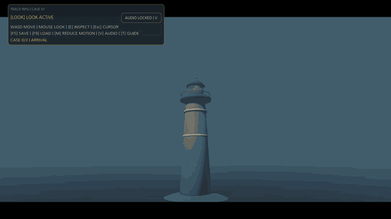

# TRACE-RPG Research Package 2026

**TRACE-RPG** is a trace-linked symbolic commit gate for generated events in an interactive game
world. A language model may *propose* quests, dialogue, and world changes, but nothing it says
becomes canonical game state until a type-strict parser, an externally supplied action policy, and
six deterministic state-relative predicates accept it. Rejected candidates get a bounded,
counterexample-guided repair; everything else falls back to the unchanged prior state, and every
terminal outcome is recorded in a checksum-linked, replayable trace.



*Play video.* The GIF above (560×315, 8 fps, 1.5× speed) is derived from
[`trace-rpg-gameplay.mp4`](game-track/godot/docs/latest/trace-rpg-gameplay.mp4) (1280×720, 30 fps,
63.433 s, 1,903 frames), recorded on 2026-09-02 with Godot 4.7.1 Movie Maker through the dev-only
`--autoplay --public-safe` route on a disposable copy of the current local build. The autopilot only
substitutes for keyboard/mouse input and drives the same interaction and choice handlers a player
would, so canonical state changed only through the proposal router: 3 commits, 1 hold, terminal
SHA-256 `4b2310173dc059071fdc98e7705608d383dda81559706c3dd33bc96983108892` — the same hash the
headless smoke reports. It is an engineering demonstration, not usability, latency, G4, or G6 evidence.
The public Web build at [sealed-lighthouse-trace-rpg.vercel.app](https://sealed-lighthouse-trace-rpg.vercel.app)
is the earlier deployment `dpl_Auzz4gjVUcgDcL45EjcRG2HVyoCW` and predates the gate line and
contribution readout shown in the recording.

> Status: the user accepted the revision direction produced by the simulated Stage 6 Major Revision
> review. The expanded claim-faithfulness audit and the guided-repair clean tagged input recapture have
> passed; this closes F6's reproducibility gate, not the separate G4/G6 game gates. This is not a
> journal decision, paper acceptance, reviewer archive, or DOI deposit. No confirmatory efficacy result
> has been produced; `C-RESULT-001`–`005` remain `TODO-RESULT`. A single-model RQ2 screening packet is
> reported only as `pilot-only`, apart from the deterministic authored-fixture counts.

## Evidence map

| Lane | Current evidence | Honest boundary |
|---|---|---|
| E1 · Deterministic offline pilot | Parser, validator, repair, replay, integrity, and accounting fixtures over one authored world; gate `13/13`, guided repair `5/5` in its class, faults `10/10`, guards `3/3`; replicated byte-identically on 2026-09-02 ([receipt](research/academic-pipeline/stage-04-replication-2026-09-02.md)) | Encoded-field mechanism conformance only |
| E2 · Live RQ2 screening | One hosted proposer; guided `5/5` versus blind `0/5` only in the deliberately repairable policy-blind cell; `15/15` noncommits state-isolated | `C-PILOT-007/008` only; no population, model-ranking, or `C-RESULT-003` promotion |
| E3 · KG/ontology simulation | 43 OKF nodes, 106 reference edges, 24 curated typed edges, 0 ontology violations, 6/6 authored holdouts | Closed-world `simulation-only`; not runtime retrieval or semantic completeness |
| ENG1 · Godot/Web engineering | 4/4 fixtures, 52/52 combined checks, 8/8 production smoke, 5/5 balance archetypes, tracked player, scripted golden-path recording | Authored-fixture and presentation conformance; not usability, fun, G4, or final G6 |
| Confirmatory study | Not executed | `C-RESULT-001`–`005` remain `TODO-RESULT` |

Contributions C1–C5, all 55 references across nine prior-work topics, the three experiment lanes, and
the engineering lane are cross-checked together in
[`contribution-reference-crosscheck.md`](research/academic-pipeline/contribution-reference-crosscheck.md),
and CI fails if any of them drift. The manuscript carries two tables generated from those matrices
(contributions × prior topics × lanes × inference ceiling; evidence lanes × design × unit × comparison
× ceiling), names the validator codes each committed guided-repair case resolved through the Table-ρ
edits, and cites the archival lineage of the gate and repair operator directly (ASPLOS 2006 CEGIS,
NeurIPS 2023 Self-Refine/Reflexion, ACM CSUR 1983 transactions, ICML 2024 LLM-Modulo, CoRL 2022 SayCan).

## Paper at a glance

Authoritative sources: [`paper/latex/en/main.tex`](paper/latex/en/main.tex) ·
[`paper/latex/ko/main.tex`](paper/latex/ko/main.tex) — current PDFs:
[`English`](paper/latex/en/main.pdf) · [`한국어`](paper/latex/ko/main.pdf)

| Item | Value |
|---|---|
| Title | TRACE-RPG: A Trace-Linked Symbolic Commit Gate for Generated Events in an Interactive Game World |
| Venue target | IEEE Transactions on Games, **Short Paper** (6–8 pp band) |
| Current PDF length | EN 8 pp · KO 8 pp; both include the live-screening and KG-simulation addenda and pass the page-band, Type 3 font, and LaTeX log gates |
| Contributions | C1 versioned trust-boundary contracts · C2 validate–repair–commit controller · C3 audit-linked evidence layer · C4 assignment-complete conformance harness · C5 counterexample-guided repair operator ρ(a,E) |
| References | 55 — 46 `VERIFIED` + 9 `PREPRINT`, 0 unmatched or hallucinated; every DOI/URL re-resolved and title-checked on 2026-09-02 ([link audit](research/academic-pipeline/stage-05-link-audit-2026-09-02.md)); 22 Semantic Scholar lookups recorded as rate-limited |
| Review model | double-anonymous |

What the paper claims, and what it explicitly does not:

| Claimed | Not claimed |
|---|---|
| A typed contract for state, policy, candidate, and record | That any model is better than another |
| A deterministic state-relative commit gate over 12 encoded codes | Player experience or narrative quality |
| Bounded repair with unchanged-state fallback | That the reference repairer is a deployable method |
| Content-linked records, semantic replay, episode continuity | Writer authentication (checksums are unkeyed) |
| Assignment-complete failure accounting | Retrieval, memory, or affect benefit |
| Conformance over **one** authored world state | Generalization to a real game at scale |

Claim ledger ([`research/claim-ledger.yaml`](research/claim-ledger.yaml)), 21 claims:

| Status | Count | Meaning |
|---|---:|---|
| `verified-designed-fixture` | 6 | Observed in frozen authored fixtures |
| `verified-primary` / `-scope-limited` / `-preprint` | 4 | Supported by cited literature |
| `verified-authored-engine-fixture` / `-render-fixture` | 2 | Godot slice conformance |
| `pilot-only` | 2 | Single-model live screening evidence with no population promotion |
| `approved-design-protocol` | 1 | Design approved, unexecuted |
| `proposed-contribution` | 1 | Architectural position |
| **`TODO-RESULT`** | **5** | **`C-RESULT-001`–`005`: no confirmatory efficacy result** |

Rebuild and verify both PDFs with `make -C paper/latex all`. The build keeps SVG sources, converts
them to source-linked vector PDFs, and rejects page-count, Type 3 font, missing-glyph,
undefined-reference, citation, and overfull-box regressions.

## Visuals

All six SVGs are produced by `scripts/generate_readme_visuals.py`. The V2 footer, V3, and V4 are read
directly from the frozen pilot CSVs and the claim ledger, so their numbers cannot drift from their
sources. Solid elements are implemented and exercised by the pilot; dashed elements are specified,
unimplemented, and carry no evidence. The bilingual [editable-visual contract](visuals/README.md) and
[machine-readable source manifest](visuals/source-manifest.json) map every rendered figure and table
to its generator, editable source, and data.

### V1 · Trust boundary


The proposer may observe the affect estimate `z_t`, graph retrieval, and temporal memory, yet none of
them holds commit authority. Canonical state changes only through `T(c_t, a_t)` after the gate
passes. Encoded validity is validity for encoded predicates only, and the shared candidate-key
contract rejects unknown top-level fields at both proposal and replay boundaries.

### V2 · One transaction


If no candidate within budget validates, canonical state remains unchanged; a failed initial
candidate may still be repaired and committed. Every completed candidate attempt is recorded before
the terminal outcome. The repair-arm figures in the footer are read from `repair-arm-summary.csv`.

### V3 · Every Stage 4 offline-pilot observation


Each denominator counts designed cases for that row alone, so rows are not comparable to one
another. `0/2` and `5/7` are designed outcomes, not regressions. No confidence interval, significance
test, or causal comparison is claimed.

### V4 · Claim ledger status


Designed-fixture evidence never promotes itself into an efficacy claim, and a verified status is
revoked if an upstream trace or analysis hash changes.

### V5 · Academic pipeline status


The original Stage 4.5 `22/22` pass is retained only as a superseded audit record: Stage 6 later
reproduced three claim defects and one unaudited body-level telemetry defect. Stage 8 corrected the
manuscript and parser contract, and the expanded audit passed 42/42 claim families. Stage 5 now
contains 55 cross-checked references (46 `VERIFIED`, 9 `PREPRINT`) with 0 unmatched or hallucinated
entries. Stage 10 binds 22/22 declared inputs, 38/38 artifacts, and 121 provenance rows to the clean
guided-repair release tag. Independent efficacy studies and journal submission remain pending. See
[`stage-04.5-claim-faithfulness-gate.md`](research/academic-pipeline/stage-04.5-claim-faithfulness-gate.md)
and [`stage-08-revision.md`](research/academic-pipeline/stage-08-revision.md).

### V6 · Planned confirmatory design (not executed)


## Research questions and what is still missing

- RQ1: Does a symbolic commit gate reduce impossible world states and forbidden disclosures across model scales?
- RQ2: Is counterexample/unsat-core repair more sample-efficient than blind retry?
- RQ3: Do graph retrieval and temporal memory improve long-horizon consistency without collapsing narrative diversity?
- RQ4: Can uncertainty-calibrated affect adaptation improve target-curve tracking without regressing hard validity?
- RQ5: Do controller gains replicate across a ten-model screen and a three-model confirmatory stage?

Each question maps to one `C-RESULT-*` claim, and all five are still `TODO-RESULT`.

| Question | What exists today | What is still missing |
|---|---|---|
| Does the code run? | Yes — full pytest: 181 passed, 81 subtests; unittest discovery: 138 passed; deterministic pilot, Godot slice, public-safe Web build, scripted golden-path recording | — |
| Is the pipeline complete? | Yes for the staged repository deliverables through Stage 10, including the final bilingual PDF rebuild and format checks | Independent efficacy studies, journal submission, and a decision remain |
| Is the paper written? | Yes — bilingual IEEE sources and 8-page PDFs, 55 link-audited references, ρ(a,E) guided repair, and separate live-screening/KG-simulation addenda | Journal submission, review, and any resulting revision remain |
| **Are the research claims proven?** | **No** | Only a five-call-per-cell RQ2 screening pilot exists; confirmatory multi-model, human, affect, retrieval, memory, and engine-performance studies are missing |

The implementation needed for the current conformance claims is complete. The **confirmatory
experiments are not**: 5 of 21 tracked claims are efficacy claims with no promotion-qualifying
evidence, and they are the ones the research questions ask.

## Experiment design (planned, not executed)

SSOT: [`configs/experiment-matrix.yaml`](configs/experiment-matrix.yaml). This confirmatory matrix has
not been run; the separate RQ2 screening pilot is not a substitute for it.

| Dimension | Stage 1 screening | Stage 2 confirmatory |
|---|---|---|
| Models | 10 (all) | 3 (promoted by frozen Pareto rule) |
| Scenarios per track | 30 | 120 |
| Repetitions | 3 | 5 |
| Controller arms | 6 | 6 |
| Grounding variants | 3 (`none`, `rag`, `kg_temporal_memory`) | 3 |
| Affect variants | — | 2 (`off`, uncertainty-calibrated) |
| Ablations | — | 6 |
| Purpose | Pareto screening; **no causal conclusion** | Preregistered full factorial |

| Arm | Gate | Repair | Grounding stack |
|---|---|---|---|
| `direct_commit` | none (unsafe baseline, isolated build) | — | — |
| `structural_constraint_only` | schema/grammar only | — | — |
| `validator_rejection_only` | state-relative | none | — |
| `matched_budget_blind_retry` | state-relative | K new proposals, no error feedback | — |
| `structured_repair` | state-relative | K repairs with structured errors | partial |
| `trace_rpg_full` | state-relative + external policy | K repairs + defensive revalidation | full |

| Track | Primary endpoint |
|---|---|
| `world-generation` | `valid_episode_rate` |
| `npc-dialogue` | `hard_dialogue_violation_rate` |
| `affect-adaptation` | `target_curve_rmse` without hard-validity regression |

Controls: seeds `11, 23, 47, 83, 131`; repair budget `K=3`; 60 s timeout; at most 4 proposal-or-repair
calls, matched across the three comparable arms; per-attempt tokens, latency, cost, and failure class
recorded. 28 metrics are catalogued in [`configs/metric-catalog.yaml`](configs/metric-catalog.yaml).

## Stage 4 paper and bounded pilot

The offline tables are generated from
`research/academic-pipeline/stage-04-pilot/pilot-results.json`: gate agreement `13/13` across 12
encoded error codes; 12 invalid repair cases partitioned as 5 guided-repairable, 1 oracle-only, and 6
irreparable; blind commits `0/12`, guided commits `5/5` in its reachable class, and oracle commits
`5/5` plus `1/1`; detectable integrity faults `10/10`; one declared repair-provenance boundary
replay-accepted `1/1`; adapter outcomes 1 commit, 1 symbolic fallback, and 5 classified failures out
of 7; assignment guards `3/3`. These are raw authored-fixture counts, not live-model, player, or
population efficacy estimates. On 2026-09-02 the same runner reproduced every CSV byte-for-byte in an
isolated directory.

A separate generated live-screening table reads only the tracked
`research/academic-pipeline/rq2-live-pilot/` packet. In the constructed `signal-repair-v2` blind cell
at `K=1`, guided repair committed `5/5` and blind retry `0/5`; four other current cells showed no
guided advantage, and all `15/15` current noncommit arm outcomes preserved prior state. This is
`screening-pilot-only`; `C-RESULT-003` remains `TODO-RESULT`.

The guided-repair recapture records tag `trace-rpg-guided-repair-inputs-20260821-v1` and
`dirty=false`. All 22 declared inputs and 38 artifact hashes recompute, and the 121 provenance rows
remain partitioned as 85 executed fixture rows plus 36 aggregate rows. This closes F6; no reviewer
archive or DOI deposit is claimed.

## KG/ontology graph store and proposal simulation

Three meanings stay separate: the sibling Graphify artifact is a document-navigation index, Python
`WorldState` remains the hard runtime authority, and the SQLite file is only a repository-local
**methods-graph mirror**. The closed application ontology declares 21 node types, 13 relation types,
domain/range rules, six validator-predicate mappings, and six executable, source-scoped competency
questions. It is not OWL/SHACL and does not implement runtime graph retrieval.


`SL-KG-ONTOLOGY-SIM-001` runs seven fixed strategies over six authored queries × five candidates: 30
candidate scores per strategy and 210 total. For selected links $S_q$ and one frozen relevant link $G_q$ per query,
$P=TP/(TP+FP)$, $R=TP/(TP+FN)$, $F_1=2PR/(P+R)$, $MRR=|Q|^{-1}\sum_q r_q^{-1}$ with realistic tie
ranks, $BS=N^{-1}\sum_i(s_i-y_i)^2$, and $Sem@K=(K|Q|)^{-1}\sum_{q,i}I[domain/range\ valid]$. The
ratchet keeps a strategy only after recall ≥0.80, coverage ≥0.95, `Sem@3=1`, and strict lexicographic
improvement. Current packet: **43 OKF nodes, 106 reference edges, 24 curated typed edges, 0 ontology
violations, 6/6 competency questions**; the retained `S2-typed-lexical-loose` strategy recovered 6/6
authored holdouts (`P=R=F1=1.000`, realistic-tie `MRR=0.944`, `BS=0.131`, `Sem@3=1.000`). These are
closed-world construction results, not semantic truth, usefulness, runtime KG efficacy, or support for
any `C-RESULT-*` claim.

```bash
PYTHONDONTWRITEBYTECODE=1 uv run python scripts/run_kg_ontology_simulation.py
PYTHONDONTWRITEBYTECODE=1 uv run python scripts/run_kg_ontology_simulation.py --check
```

Outputs: [JSON matrix](research/simulation/kg-ontology/latest/evaluation-matrix.json),
[formula/strategy report](research/simulation/kg-ontology/latest/evaluation-matrix.md),
[TSV trials](research/simulation/kg-ontology/latest/strategy-trials.tsv),
[recommendations](research/simulation/kg-ontology/latest/recommendations.json), SVG, bilingual generated
TeX, hashes, and the ignored runtime SQLite mirror. The machine ontology is
[`knowledge/ontology/trace-rpg-ontology.json`](knowledge/ontology/trace-rpg-ontology.json).

## Experimental game track: *The Sealed Lighthouse*

*The Sealed Lighthouse* is an 8–12 minute target, turn-based narrative investigation micro-RPG. Its
primary planned experiment uses structured text and canonical state; a separately labelled secondary
VLM/UI track may later use reviewed, checksum-locked derivatives. Curated Higgsfield UI and player
assets ship in the presentation lane only and never enter experiment inputs or canonical state. Start
with [`game-track/design/gdd.en.md`](game-track/design/gdd.en.md),
[`game-track/design/paper-crosswalk.en.md`](game-track/design/paper-crosswalk.en.md), and
[`configs/experimental-game.yaml`](configs/experimental-game.yaml). No participant has been recruited
and no personal telemetry or human outcome exists.

### Cycle 3 public-safe playable

The Godot 4.7.1 playable adds third-person harbor exploration, proposal-gated interaction, a
responsive English ledger UI, reduced motion, pooled procedural VFX, gesture-gated procedural audio,
and a tracked player rig with `Idle`/`Casual_Walk`. Its narrative payoff is restoration of the
harbor-side signal and acquisition of the tide route; the offshore lighthouse remains sealed.

The ledger mirrors the paper's commit gate diegetically. Every hold names the state-relative predicate
family that held it (`[V] GATE DISCLOSURE | state unchanged`) and teaches the rule (`RULE LEARNED` /
`RULE RECALLED`); every commit posts `CONTRIBUTION #N` + `UNLOCKED` and advances the `CASE CHAIN` HUD
line; the end card reports `ENTRIES`, `HOLDS`, `HOLDS BY GATE`, and the validator state hash. This
readout is presentation-only: it derives from the two snapshots the hard writer returns and authored
label tables, never from a second state model.

| `SL-PLAY-EVAL-001` row | Checks | Result |
|---|---:|---|
| Canonical fixture | `10/10` | PASS |
| Duplicate-event fixture | `10/10` | PASS |
| Timeout fixture | `10/10` | PASS |
| Corrupt-save fixture | `10/10` | PASS |
| Presentation invariants | `12/12` | PASS |
| **Combined** | **`52/52`** | **PASS** |
| Public-safe 3D smoke | `8/8` | PASS, terminal SHA-256 `4b231017…108892` |
| Archetype balance probe | `SL-BALANCE-PROBE-001` 5/5 | PASS |

See [`SL-PLAY-EVAL-001`](game-track/godot/docs/latest/evaluation-matrix.md) and its
[JSON record](game-track/godot/docs/latest/evaluation-matrix.json).

| Arrival | Refusal (gate line) |
|---|---|
|  |  |
| Authorized hint | Ending receipt |
|  |  |

These four 1280×720 files and the recording above are engineering working captures, not immutable
research evidence. G4, usability, immersion, affect, player efficacy, and confirmatory model efficacy
are **UNASSESSED**. G6 remains `FIX` pending production save/reload, current mobile verification,
human-gesture pointer/audio checks, warmed frame/input, a 30-minute soak, and rollback evidence.

```bash
./scripts/build_godot_web.sh                       # disposable-copy Web export
python3 -m http.server 4173 --directory game-track/web/public
uv run python scripts/run_playable_evaluation.py   # SL-PLAY-EVAL-001 on a disposable copy
```

Deployment: **[`dpl_Auzz4gjVUcgDcL45EjcRG2HVyoCW` READY on Vercel](https://sealed-lighthouse-trace-rpg.vercel.app)**
(PCK 10,893,980 bytes, SHA-256 `654c1f136de9e15b37be4d697daf863dccf20d1a59287ae86f635d0d7e1a58e7`);
all 10 public runtime files returned anonymous `200` responses and matched the local bytes. The
current local build (with the gate line, contribution readout, and autoplay route) has been rebuilt
but not redeployed. Pointer lock is **not verified** by automation, so it remains a human-gesture
check. See [`game-track/web/README.md`](game-track/web/README.md).

## Quick start

```bash
uv sync --extra research --extra dev
uv run python -m unittest discover -s tests -v
uv run python scripts/validate_project.py
uv run python scripts/validate_contribution_crosswalk.py
uv run python scripts/validate_visual_assets.py --require-pdf-tools --check-regeneration
./scripts/validate_game_track.sh
uv run python examples/recorded_experiment.py
./scripts/verify_like_ci.sh                        # every CI step, in order
```

Optional local LLM access uses the official Codex device-code flow; the wrapper never reads or
prints credentials, runs each prompt ephemerally in a disposable read-only workspace, and returns
only a non-authoritative soft proposal. It is not included in the public Web build and cannot commit
canonical game state. See [`docs/codex-oauth-llm.en.md`](docs/codex-oauth-llm.en.md).

## Layout

| Path | Purpose |
|---|---|
| `paper/latex/en`, `paper/latex/ko` | Authoritative English and Korean IEEE manuscripts and PDFs |
| `paper/en`, `paper/ko` | Superseded future confirmatory-protocol blueprints |
| `configs/` | SSOT for ten models, treatments, scenarios, and metrics |
| `src/nesy_game/` | Deterministic contracts, validator, repair operator, and runtime |
| `game-track/` | Engine-neutral contracts, bilingual GDD, Godot slice, Web export config, and public asset-exclusion record |
| `_workspace/current/` | Single live game-studio production, design, engineering, QA, UI, and ops workspace |
| `research/` | Immutable sources, Scrapling captures, academic pipeline, evidence and claim ledgers |
| `harness/` | Agent roles, workflows, and validation gates |
| `../llm-wiki/` | Project wiki and Graphify knowledge graph |
| `visuals/` | README SVG sources plus the editable-visual contract and source manifest |
| `scripts/` | Validators, pilot runner, and the paper-figure, table, and README-visual generators |

## Reproducibility boundary

- LLMs/VLMs propose candidates or soft signals; they never constitute canonical world state.
- SMT/rule checking guarantees only encoded constraints. Semantic false negatives are measured separately.
- Synthetic players and the autoplay route are stress-test and demonstration instruments, not evidence of human experience.
- Raw sources and execution traces are immutable, and paper tables must be generated from trace IDs.
- “Open weight” is not treated as a synonym for “open source”; every model retains an explicit license and policy record.

## Journal target and execution order

The primary candidate is **IEEE Transactions on Games**; **Knowledge-Based Systems** is the
method-first alternative. SCIE coverage must be rechecked in the Clarivate Master Journal List
immediately before submission. Journal-level claims require a preregistered primary endpoint,
pilot-informed prospective power analysis, world- and quest-template holdouts, mixed-effects models,
effect sizes with 95% confidence intervals, multiplicity correction, independent human evaluation,
failure analysis, and assignment-complete outcome records. Detailed venue gate:
[`research/journal-targets.md`](research/journal-targets.md).

1. Pilot scenario difficulty, validator omission rates, and human-rating variance.
2. Freeze the analysis plan and primary endpoints; determine sample size through power analysis.
3. Screen ten models cheaply and promote three through a preregistered Pareto rule.
4. Run the confirmatory 3-model × 6-system × 3-track experiment and ablations.
5. Admit only independently audited, assignment-complete and outcome-classified runs; require a complete trace when a proposal outcome exists, while retaining classified terminal failures for which no proposal trace can exist.
