# TRACE-RPG 연구 패키지 2026

> 상태: 사용자가 Stage 6 모의 Major Revision 심사에서 나온 개정 방향을 수용했다. 확장 주장 충실성 감사와 guided-repair clean tagged input 재캡처가 통과하여 F6 재현성 gate는 종결됐지만, 별도 G4/G6 게임 gate는 종결되지 않았다. 이는 저널 결정, 논문 게재 승인, 심사 archive 또는 DOI deposit이 아니다. 확증 효능 결과는 아직 없으며 `C-RESULT-001`--`005`는 `TODO-RESULT`다. 별도 단일 모델 RQ2 스크리닝 패킷만 결정론적 작성 fixture count와 분리해 `pilot-only`로 보고한다.

TRACE-RPG는 LLM이 제안한 세계 변화와 NPC 발화를 곧바로 게임 상태에 기록하지 않는다. Parsing에 성공한 제안은 typed candidate event가 되고, 외부에서 공급된 행동 정책과 precondition·도달 가능성·NPC 지식·정보 공개·quest stage에 대한 결정론적 검사를 통과한 경우에만 커밋된다. 유효하지 않은 후보는 구조화 validation error를 만들고 제한된 repair 기회를 받을 수 있으며, adapter와 controller failure는 분류된 terminal row로 남는다. 지식 그래프 검색과 게임 엔진 연동은 versioned event contract로 연결되는 별도 확증 트랙이며, 현재 파일럿에서 완료된 근거로 표현하지 않는다.

## 근거 지도

| 레인 | 현재 근거 | 정직한 경계 |
|---|---|---|
| 결정론적 오프라인 파일럿 | 단일 작성 세계의 parser, validator, repair, replay, integrity, accounting fixture | 인코딩된 필드의 mechanism 적합성만 지지 |
| 라이브 RQ2 스크리닝 | hosted proposer 하나, 의도적으로 수리 가능한 policy-blind 셀에서만 guided `5/5` 대 blind `0/5` | `C-PILOT-007/008`만 지지, 모집단·모델 순위·`C-RESULT-003` 승격 없음 |
| KG/온톨로지 시뮬레이션 | OKF node 43개, reference edge 106개, curated typed edge 24개, 작성 holdout 6/6 | closed-world `simulation-only`, 런타임 검색·의미 완전성 아님 |
| Godot/Web 엔지니어링 | fixture 4/4, combined check 49/49, 추적 플레이어, 프로덕션 데스크톱 스모크 | 작성 fixture·presentation 적합성, usability·재미·G4·최종 G6 아님 |
| 확증 연구 | 미실행 | `C-RESULT-001`–`005`는 `TODO-RESULT` 유지 |

기여도 C1–C5, 45개 레퍼런스의 9개 주제, 세 실험 레인과 엔지니어링 레인의 근거 상한은
[`contribution-reference-crosscheck.md`](research/academic-pipeline/contribution-reference-crosscheck.md)에서 함께 교차검증한다.

## 시각 자료

여섯 개 SVG는 모두 `scripts/generate_readme_visuals.py`가 생성한다. V2 하단, V3, V4는 동결된 파일럿 CSV와 주장 원장에서 직접 읽으므로 원본 수치와 어긋날 수 없다. 실선은 구현되어 파일럿에서 실행된 요소이고, 점선은 명세만 있고 근거가 없는 미구현 요소다.

### V1 · 신뢰 경계

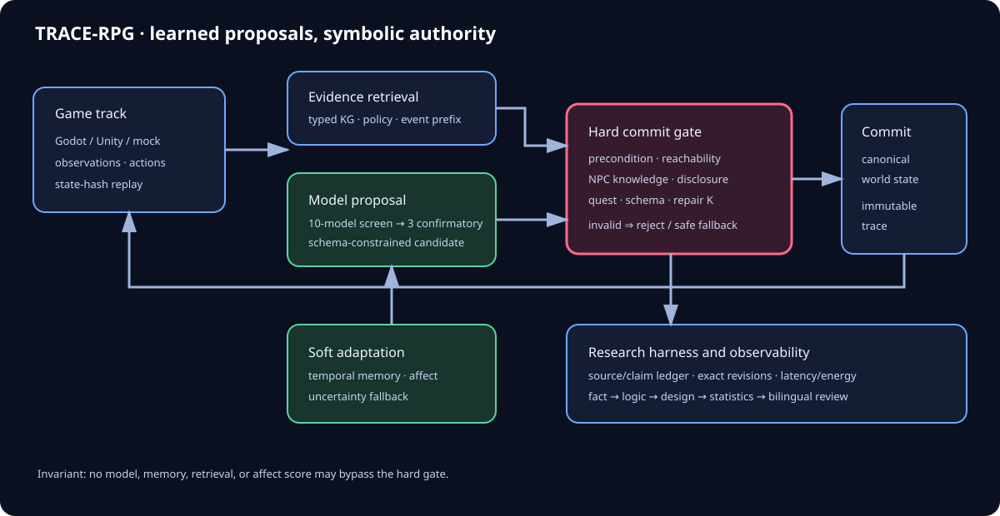

제안자는 감정 추정 `z_t`, 그래프 검색, 시간 메모리를 관찰할 수 있으나 이들 중 어느 것도 커밋 권한을 갖지 않는다. 정식 상태는 게이트를 통과한 `T(c_t, a_t)`로만 바뀐다. 인코딩된 유효성은 인코딩된 술어에 한한 유효성이며, 공유 candidate-key 계약은 proposal과 replay 양쪽에서 알 수 없는 최상위 field를 거부한다.

### V2 · 단일 트랜잭션

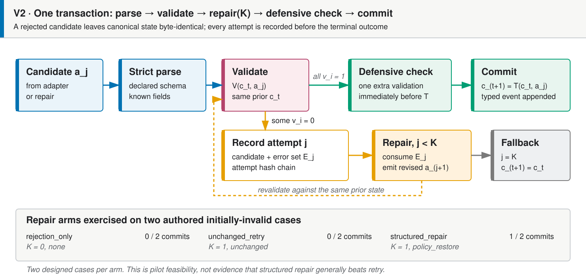

예산 안에서 어떤 후보도 검증을 통과하지 못하면 정식 상태는 그대로 유지된다. 최초 후보가 실패해도 수리 후 commit될 수 있으며, 완료된 candidate attempt는 종단 결과 전에 모두 기록된다. 하단 repair arm 수치는 `repair-arm-summary.csv`에서 읽는다.

### V3 · Stage 4 오프라인 파일럿 관찰값 전체

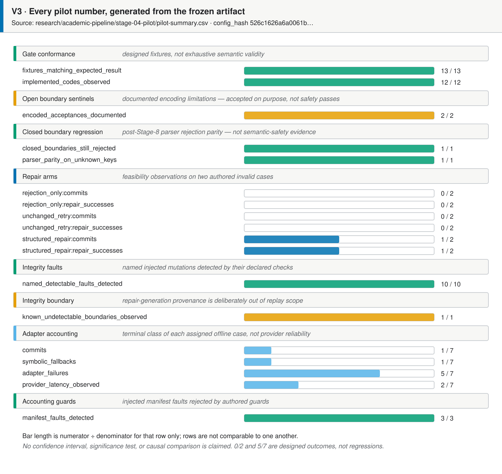

각 행의 분모는 그 행에 한정된 설계 사례 수이며 행 간 비교는 성립하지 않는다. `0/2`와 `5/7`은 설계된 결과이지 회귀가 아니다. 신뢰구간, 유의성 검정, 인과 비교는 주장하지 않는다.

### V4 · 주장 원장 상태

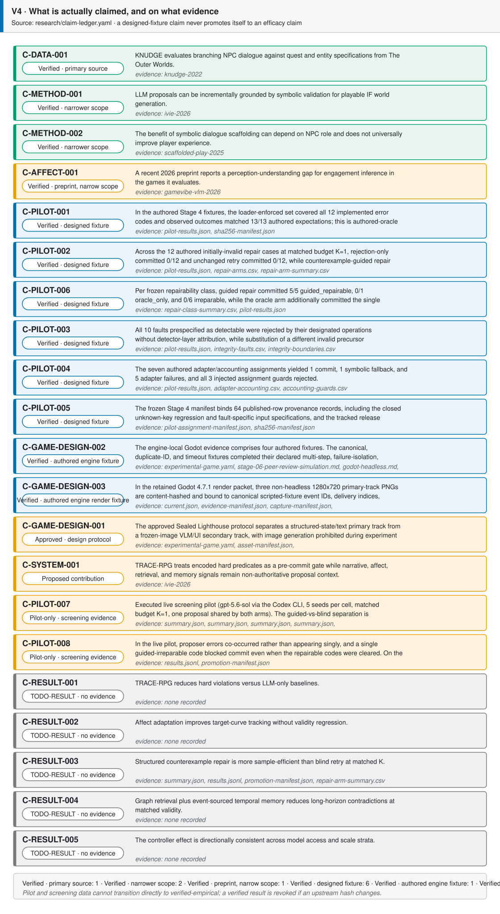

설계 fixture 근거는 효능 주장으로 승격되지 않는다. 상류 trace나 분석 해시가 바뀌면 검증 상태는 취소된다.

### V5 · 학술 파이프라인 진행 상태

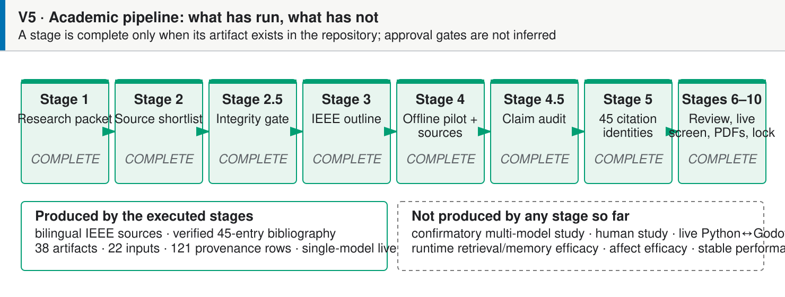

원래 Stage 4.5의 `22/22` 통과 판정은 대체된 감사 기록으로만 보존한다. Stage 6에서 주장
결함 3건과 감사 범위 밖의 본문 telemetry 결함 1건을 재현했고, Stage 8에서 원고와 parser
계약을 수정했으며 확장 감사는 주장 family 42/42를 통과했다. Stage 5에는 미일치·환각 0건의
동일성 검증 참고문헌 45건이 있다. Stage 10은 선언 입력 22/22, 산출물 38/38, provenance row
121개를 clean guided-repair release tag에 결합한다. 최종 Stage 9 영문·국문 PDF는 이제
live-screening과 KG-simulation addendum을 포함한다. 둘 다 8쪽이며 쪽수 밴드, Type 3 font,
LaTeX log gate를 통과했다. 독립 효능 실험과 저널 투고는 아직 남아 있다. 상세 내용은
[`research/academic-pipeline/stage-04.5-claim-faithfulness-gate.md`](research/academic-pipeline/stage-04.5-claim-faithfulness-gate.md)와
[`research/academic-pipeline/stage-08-revision.md`](research/academic-pipeline/stage-08-revision.md)에 있다.

### V6 · 계획된 확증 설계 (미실행)

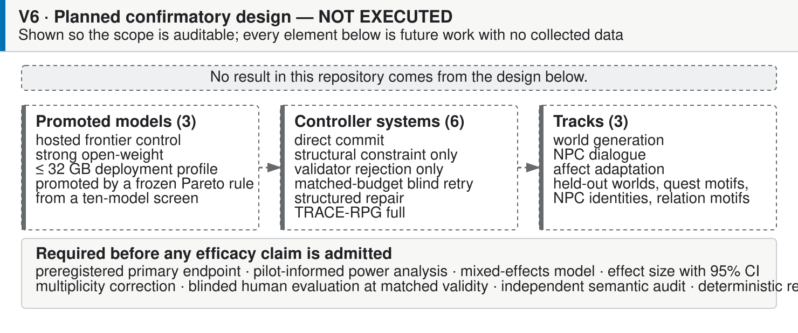

## 목표 저널과 논문 수준

1차 투고 후보는 게임 AI·플레이어 모델링·게임 평가 범위가 직접 맞는 **IEEE Transactions on Games**다. 방법론 기여가 더 강하면 **Knowledge-Based Systems**, 감정 추론의 독립적 기여가 충분하면 **IEEE Transactions on Affective Computing**, 응용·사용자 연구 중심이면 **Entertainment Computing**을 재검토한다. 색인 상태는 변할 수 있으므로 제출 직전 Clarivate Master Journal List에서 SCIE 여부를 다시 확인하는 것을 필수 게이트로 둔다.

저널 수준 주장은 사전등록된 1차 평가지표, 파일럿 분산에 근거한 검정력 분석, 세계·퀘스트 템플릿
단위 홀드아웃, 혼합효과모형, 효과크기와 95% 신뢰구간, 다중비교 보정, 독립 인간평가, 실패 분석,
assignment-complete outcome record, proposal outcome이 존재할 때의 완전한 trace를 요구한다.

상세 투고 게이트: [`research/journal-targets.ko.md`](research/journal-targets.ko.md)

## 핵심 연구 질문

- RQ1: 심볼릭 커밋 게이트가 모델 크기와 무관하게 불가능한 세계 상태와 정보 누설을 줄이는가?
- RQ2: 반례/unsat-core 기반 수리가 단순 재시도보다 유효 상태를 더 효율적으로 복구하는가?
- RQ3: 지식 그래프 검색과 시간 메모리가 장기 대화 일관성을 높이면서 서사 다양성을 보존하는가?
- RQ4: 불확실성 보정된 감정 신호가 하드 유효성을 악화시키지 않고 목표 긴장 곡선 추종을 개선하는가?
- RQ5: 동일 컨트롤러의 이득이 10개 모델 스크리닝과 3개 모델 확증 단계에서 재현되는가?

각 질문은 하나의 `C-RESULT-*` 주장에 대응하며, 다섯 개 모두 아직 `TODO-RESULT`다. 아래 표는
저장소가 **구축한 것**과 **측정한 것**을 분리한다.

## 한눈에 보기

| 질문 | 현재 존재하는 것 | 아직 없는 것 |
|---|---|---|
| 코드가 동작하는가? | 예 — 전체 pytest 172 passed, 2 skipped; unittest discovery 131 passed, 2 skipped; 결정론적 파일럿, Godot 슬라이스, 공개 안전 Web 빌드 | — |
| 파이프라인이 완료됐는가? | Stage 10까지의 저장소 단계 산출물은 최종 영문·국문 PDF 재빌드와 형식 검사를 포함해 완료 | 독립 효능 실험, 저널 투고, 심사 결정은 남아 있음 |
| 논문이 작성됐는가? | 예 — 최신 이중언어 IEEE source와 8쪽 PDF, 논문 참고문헌 45건, ρ(a,E) 유도 수리, 별도 live-screening/KG-simulation addendum | 저널 투고, 심사, 그 결과에 따른 개정은 남아 있음 |
| **연구 주장이 입증됐는가?** | **아니오** | 셀당 5회 RQ2 스크리닝 파일럿만 존재하며, 확증 다중 모델·인간·감정·검색·메모리·엔진 성능 연구는 없다 |

현재 적합성 주장을 뒷받침하는 구현은 완료됐다. 그러나 **확증 실험은 완료되지 않았다.** 추적 중인
21개 주장 가운데 5개는 승격 요건을 만족하는 근거가 없는 효능 주장이며, 그 5개가 바로 연구 질문이 묻는 대상이다.

## 실험 설계 (계획, 미실행)

SSOT: [`configs/experiment-matrix.yaml`](configs/experiment-matrix.yaml). 이 확증 matrix는
실행되지 않았고 별도 RQ2 스크리닝 파일럿이 이를 대체하지 않는다. 범위를 감사 가능하게 남기기
위해 기록한다.

| 차원 | Stage 1 스크리닝 | Stage 2 확증 |
|---|---|---|
| 모델 | 10개 (전체) | 3개 (동결 Pareto 규칙으로 승격) |
| 트랙별 시나리오 | 30 | 120 |
| 반복 | 3 | 5 |
| 컨트롤러 arm | 6 | 6 |
| Grounding 변형 | 3 (`none`, `rag`, `kg_temporal_memory`) | 3 |
| Affect 변형 | — | 2 (`off`, 불확실성 보정) |
| Ablation | — | 6 |
| 목적 | Pareto 선별, **인과 결론 없음** | 사전등록 완전 요인 설계 |

여섯 개 컨트롤러 arm은 활성화하는 스택 범위 순으로 배열해, 각 비교가 하나의 메커니즘만 분리한다.

| Arm | 게이트 | 수리 | Grounding 스택 |
|---|---|---|---|
| `direct_commit` | 없음 (안전하지 않은 baseline, 격리 빌드) | — | — |
| `structural_constraint_only` | schema/grammar만 | — | — |
| `validator_rejection_only` | 상태 상대 | 없음 | — |
| `matched_budget_blind_retry` | 상태 상대 | K회 신규 제안, 오류 피드백 없음 | — |
| `structured_repair` | 상태 상대 | 구조화 오류를 받는 K회 수리 | 부분 |
| `trace_rpg_full` | 상태 상대 + 외부 정책 | K회 수리 + 방어적 재검증 | 전체 |

| 트랙 | 1차 평가지표 |
|---|---|
| `world-generation` | `valid_episode_rate` |
| `npc-dialogue` | `hard_dialogue_violation_rate` |
| `affect-adaptation` | 하드 유효성 악화 없는 `target_curve_rmse` |

통제 변수: seed `11, 23, 47, 83, 131`, repair budget `K=3`, 타임아웃 60초, 제안·수리 호출 최대 4회를
비교 가능한 세 arm에 동일 적용, 시도별 토큰·지연·비용·실패 클래스 기록. 지표 28개는
[`configs/metric-catalog.yaml`](configs/metric-catalog.yaml)에 정의돼 있다.

## KG/온톨로지 그래프 저장소와 제안 시뮬레이션

프로젝트는 세 의미를 분리한다. 형제 Graphify 산출물은 문서 탐색 index이고, Python
`WorldState`는 계속 하드 런타임 권위이며, 새 SQLite 파일은 저장소 로컬 **방법론 그래프
mirror**일 뿐이다. 폐쇄형 application ontology는 node type 21개, relation type 13개,
domain/range 규칙, validator 술어 대응 6개, source별 최소치를 둔 실행 가능 competency question
6개를 선언한다. OWL/SHACL이 아니며 런타임 그래프 검색을 구현하지 않는다.

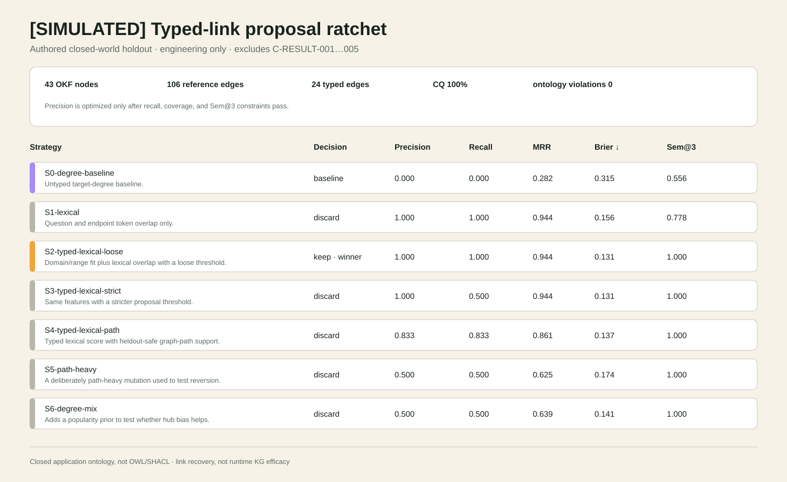

`SL-KG-ONTOLOGY-SIM-001`은 작성 질의 6개 × 후보 5개에서 고정 전략 7개를 실행한다. 전략당 후보 점수 30개, 전체 210개다.
선택 링크 $S_q$와 질의당 동결 관련 링크 하나 $G_q$에 대해
$P=TP/(TP+FP)$, $R=TP/(TP+FN)$, $F_1=2PR/(P+R)$,
realistic tie rank를 쓰는 $MRR=|Q|^{-1}\sum_q r_q^{-1}$,
$BS=N^{-1}\sum_i(s_i-y_i)^2$,
$Sem@K=(K|Q|)^{-1}\sum_{q,i}I[domain/range\ valid]$를 계산한다.
Ratchet은 recall ≥0.80, coverage ≥0.95, `Sem@3=1`을 통과하고 사전식으로 엄격히 개선된
전략만 keep한다.

현재 결정론적 packet은 **OKF node 43개, reference edge 106개, curated typed edge 24개,
ontology violation 0개, competency question 6/6**이다. 선택된
`S2-typed-lexical-loose`는 작성 holdout 6/6을 복원했다
(`P=R=F1=1.000`, realistic-tie `MRR=0.944`, `BS=0.131`, `Sem@3=1.000`).
이는 closed-world 구성 결과일 뿐 독립적 의미 진실, 사용자 유용성, 런타임 KG 효능,
장기 메모리 근거 또는 어떤 `C-RESULT-*` claim의 근거도 아니다.

```bash
PYTHONDONTWRITEBYTECODE=1 uv run python scripts/run_kg_ontology_simulation.py
PYTHONDONTWRITEBYTECODE=1 uv run python scripts/run_kg_ontology_simulation.py --check
sqlite3 research/simulation/kg-ontology/latest/trace-rpg-knowledge.sqlite \
  'SELECT relation, COUNT(*) FROM edge GROUP BY relation ORDER BY relation;'
```

산출물은 정확한 [JSON matrix](research/simulation/kg-ontology/latest/evaluation-matrix.json),
[수식·전략 보고서](research/simulation/kg-ontology/latest/evaluation-matrix.md),
[TSV trial](research/simulation/kg-ontology/latest/strategy-trials.tsv),
[개선 제안](research/simulation/kg-ontology/latest/recommendations.json), SVG, 영문·국문 generated
TeX, hash, ignored runtime SQLite mirror다. machine ontology는
[`knowledge/ontology/trace-rpg-ontology.json`](knowledge/ontology/trace-rpg-ontology.json)에 있다.

## 논문 한눈에 보기

정식 source: [`paper/latex/en/main.tex`](paper/latex/en/main.tex) ·
[`paper/latex/ko/main.tex`](paper/latex/ko/main.tex)

현재 재빌드 PDF: [`English`](paper/latex/en/main.pdf) ·
[`한국어`](paper/latex/ko/main.pdf)

| 항목 | 값 |
|---|---|
| 제목 | TRACE-RPG: A Trace-Linked Symbolic Commit Gate for Generated Events in an Interactive Game World |
| 목표 저널 | IEEE Transactions on Games, **Short Paper** (6–8쪽 밴드) |
| 현재 PDF 분량 | 영문 8쪽 · 국문 8쪽, 두 PDF 모두 live-screening·KG-simulation addendum을 포함하고 저장소 논문 검사를 통과 |
| 절 수 | 11개, 두 언어 동일 |
| 참고문헌 | 45건 — Stage 5 동일성 검증 42건 + 2026-08-21 검증 추가 3건, 환각 0건 |
| 심사 방식 | 이중 익명 |

논문이 주장하는 것과 명시적으로 주장하지 않는 것:

| 주장하는 것 | 주장하지 않는 것 |
|---|---|
| 상태·정책·후보·레코드의 타입 계약 | 특정 모델이 다른 모델보다 우수하다는 것 |
| 인코딩된 12개 코드에 대한 결정론적 상태 상대 커밋 게이트 | 플레이어 경험이나 서사 품질 |
| 변경 없는 fallback을 갖춘 제한 수리 | 참조 repairer가 배포 가능한 방법이라는 것 |
| 콘텐츠 연결 레코드, 의미 재생, 에피소드 연속성 | 작성자 인증 (체크섬은 키 없음) |
| 할당 완전 실패 계수 | 검색·메모리·감정의 이득 |
| **단일** 작성 world state에 대한 적합성 | 실제 게임 규모로의 일반화 |

주장 원장([`research/claim-ledger.yaml`](research/claim-ledger.yaml)) 21건:

| 상태 | 개수 | 의미 |
|---|---:|---|
| `verified-designed-fixture` | 6 | 동결된 작성 fixture에서 관찰 |
| `verified-primary` / `-scope-limited` / `-preprint` | 4 | 인용 문헌이 뒷받침 |
| `verified-authored-engine-fixture` / `-render-fixture` | 2 | Godot 슬라이스 적합성 |
| `pilot-only` | 2 | 모집단 승격 없는 단일 모델 라이브 스크리닝 근거 |
| `approved-design-protocol` | 1 | 설계 승인, 미실행 |
| `proposed-contribution` | 1 | 아키텍처 관점 |
| **`TODO-RESULT`** | **5** | **`C-RESULT-001`–`005`: 확증 효능 결과 없음** |

## 빠른 시작

```bash
uv sync --extra research --extra dev
uv run python -m unittest discover -s tests -v
uv run python scripts/validate_project.py
uv run python scripts/validate_harness.py
./scripts/validate_game_track.sh
./scripts/validate_codex_oauth_llm.sh
uv run python examples/headless_demo.py
uv run python examples/recorded_experiment.py
uv run python scripts/generate_readme_visuals.py
```

선택형 로컬 LLM 접근은 공식 Codex device-code 흐름을 사용한다. wrapper는 credential을 직접
읽거나 출력하지 않고, 매 prompt를 폐기형 read-only 임시 workspace에서 실행하며 명시적
`request_id`가 있는 비권위 소프트 제안만 반환한다. 공개 Web 빌드에는 포함되지 않으며 정식 game
state를 commit할 수 없다. 상세 내용은
[`docs/codex-oauth-llm.ko.md`](docs/codex-oauth-llm.ko.md)에 있다.

현재 실행 범위에는 로컬 정책 검증기, 제한 수리/fallback, operation/상태 해시 JSONL replay,
네트워크 없는 recorded-response 어댑터와 Godot 4.x headless *봉인된 등대* 정책 미러 슬라이스가
포함된다. 게임 슬라이스는 퀘스트 진행, 단계별 공개, 실패 상태 불변, 저장/불러오기, 재생, 저자 설계
결함 fixture, 안정 envelope 스키마 projection을 실행하는 엔진 로컬 적합성 근거다. 실제
Python↔Godot 권한 transport, 10개 모델 추론, 영속 라이브 transport, MLflow/에너지 텔레메트리,
인간 모집은 미실행이다.

## 디렉터리

| 경로 | 역할 |
|---|---|
| `paper/latex/en`, `paper/latex/ko` | 정식 영문·국문 IEEE Stage 4 원고와 PDF |
| `paper/en`, `paper/ko` | 대체된 미래 확증 연구 프로토콜 청사진 |
| `configs/` | 10개 모델, 실험군, 시나리오, 평가 지표 SSOT |
| `src/nesy_game/` | 결정론적 계약과 최소 검증기 |
| `game-track/` | 엔진 독립 계약, 이중언어 실험 GDD, Godot 슬라이스, fail-closed 공개 자산 제외 기록 |
| `_workspace/current/` | 단일 최신 게임 스튜디오 기획·제작·엔지니어링·QA·UI·운영 워크스페이스 |
| `research/` | 원본 보존, Scrapling 캡처, 근거·주장 원장, 심층연구 |
| `harness/` | 에이전트 역할, 워크플로우, 검증 게이트 |
| `../llm-wiki/` | 프로젝트 지식 위키와 Graphify 그래프 |
| `visuals/` | README·논문용 SVG 원본 (`scripts/generate_readme_visuals.py`가 생성) |
| `scripts/` | 검증기, 파일럿 runner, 논문 그림·표·README 시각 자료 생성기 |

## Stage 4 원고와 범위가 제한된 파일럿

정식 IEEE short-paper 원고는 `paper/latex/en/main.pdf`와 `paper/latex/ko/main.pdf`다.
오프라인 표는 `research/academic-pipeline/stage-04-pilot/pilot-results.json`에서 생성된다.
인코딩 오류 코드 12종에 대한 게이트 일치 `13/13`, 무효 수리 사례 12개를 guided-repairable
5개·oracle-only 1개·irreparable 6개로 분할, blind commit `0/12`, 도달 가능한 class에서 guided
`5/5`, oracle `5/5`와 `1/1`, 탐지 가능 무결성 결함 `10/10`, repair-provenance 경계 replay
허용 `1/1`, adapter 결과 7건 중 commit 1건·기호 fallback 1건·분류된 failure 5건, 배정 guard
`3/3`이다. 이는 저자가 설계한 fixture의 원시 count이며 live model, player 또는 모집단 효능
추정치가 아니다.

별도 생성 라이브 스크리닝 표는 추적된 `research/academic-pipeline/rq2-live-pilot/` 패킷만
읽는다. `K=1`의 구성된 `signal-repair-v2` blind 셀에서 guided는 `5/5`, blind retry는 `0/5`를
commit했고 다른 현재 셀 4개에서는 guided 우위가 없었다. 현재 셀의 noncommit arm 결과
`15/15`는 prior state를 보존했다. 이는 `screening-pilot-only`이며 `C-RESULT-003`은
`TODO-RESULT`로 남는다.

Guided-repair 재캡처는 tag `trace-rpg-guided-repair-inputs-20260821-v1`와 `dirty=false`를
기록한다. 선언 입력 22개와 산출물 hash 38개가 모두 재계산되고 provenance row 121개는 실행
fixture row 85개와 aggregate row 36개로 나뉜다. Manifest는 절대 사용자·clone 경로 없이
이식 가능한 `uv run python` 명령을 사용한다. 이로써 F6는 종결되지만 심사 archive 또는 DOI
deposit은 주장하지 않는다.

두 PDF는 `make -C paper/latex all`로 재생성·검증한다. 빌드는 SVG 원본을 보존하면서
Type 3 font를 피하기 위한 고해상도 PNG를 포함하고, 쪽수·Type 3 font·누락 glyph·정의되지
않은 reference/citation·overfull box 회귀를 거부한다.

## 재현성 경계

- LLM/VLM은 후보를 만들거나 소프트 신호를 제안할 뿐, 권위 있는 세계 상태가 아니다.
- SMT/규칙 검증은 **인코딩된 제약**만 보증한다. 의미 검증 누락은 별도 false-negative 감사로 측정한다.
- 합성 플레이어는 스트레스 테스트 도구이며 인간 경험의 증거가 아니다.
- `raw/`와 실행 추적은 불변이며, 논문 표는 추적 ID에서만 생성한다.
- 공개 가중치와 오픈소스를 같은 뜻으로 쓰지 않는다. 라이선스와 사용 정책을 모델별로 기록한다.

## 실험 게임 트랙

*봉인된 등대*는 5회 심층 인터뷰로 확정한 8--12분 목표의 턴 기반 내러티브 수사
micro-RPG다. 1차 계획 실험은 구조화 텍스트와 정식 상태를 사용한다. 별도 2차 VLM/UI 연구
트랙은 향후 인간 검토를 통과한 체크섬 동결 파생본만 내부 패킷에서 사용할 수 있으며, 검토 대기
콘셉트 후보는 여기서 ID/해시로만 제외 관리한다. 별도 큐레이션 Higgsfield UI·플레이어 자산은
프레젠테이션 lane에 포함되지만 실험 입력이나 정식 상태에는 들어가지 않는다. 실험 중 이미지
생성도 금지한다. `game-track/design/gdd.ko.md`,
`game-track/design/paper-crosswalk.ko.md`, `configs/experimental-game.yaml`에서 시작한다.

인간 연구는 프로토콜·도구 설계 범위다. 참가자를 모집하지 않았고 개인 텔레메트리나 인간
결과도 없다. Godot/headless 측정은 어떤 `C-RESULT-*` 주장도 승격하지 않는다.

### Cycle 3 public-safe 플레이어블

현재 Godot 4.7.1 플레이어블은 3인칭 항구 탐색, 제안 게이트 상호작용, 반응형 장부 UI,
모션 감소, 풀링된 절차 VFX, 사용자 제스처 뒤 활성화되는 로컬 생성 음향을 제공한다. 플레이어는
항구 측 신호를 복구하고 썰물 항로를 얻으며, 앞바다 등대는 봉인된 채로 남는다.

| `SL-PLAY-EVAL-001` 행 | 검사 | 결과 |
|---|---:|---|
| 정식 fixture | `10/10` | PASS |
| 중복 이벤트 fixture | `10/10` | PASS |
| timeout fixture | `10/10` | PASS |
| 손상 저장 fixture | `10/10` | PASS |
| 프레젠테이션 불변조건 | `9/9` | PASS |
| **합계** | **`49/49`** | **PASS** |
| 아키타입 밸런스 프로브 | `SL-BALANCE-PROBE-001` 5/5 | PASS |

fixture `4/4` 모두
`4b2310173dc059071fdc98e7705608d383dda81559706c3dd33bc96983108892`에 도달했다. 상세 표는
[`SL-PLAY-EVAL-001`](game-track/godot/docs/latest/evaluation-matrix.md), 기계 판독 기록은
[JSON](game-track/godot/docs/latest/evaluation-matrix.json)에 있다.

| 도착 | 보류 |
|---|---|
| 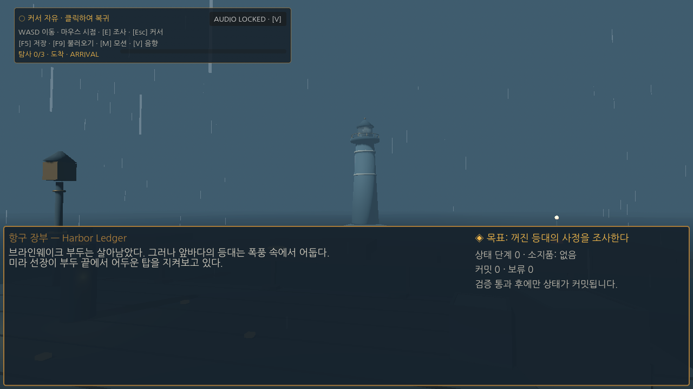 | 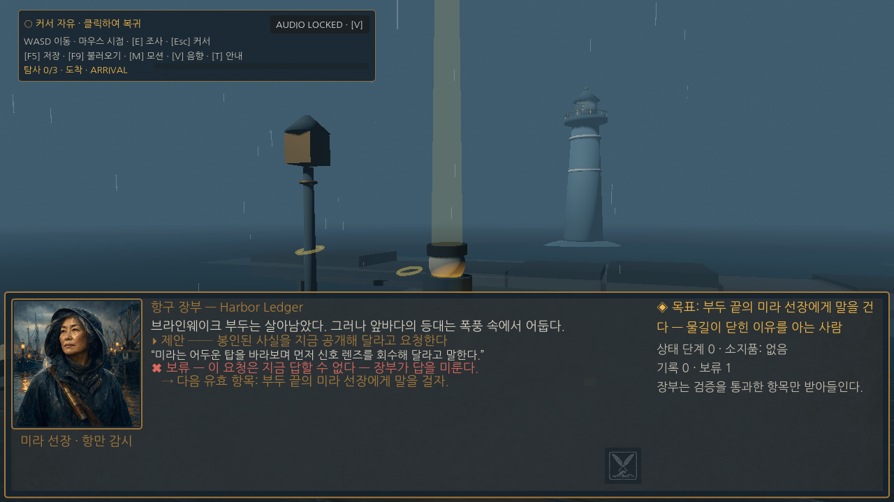 |
| 승인 단서 | 항로 획득 결말 |
| 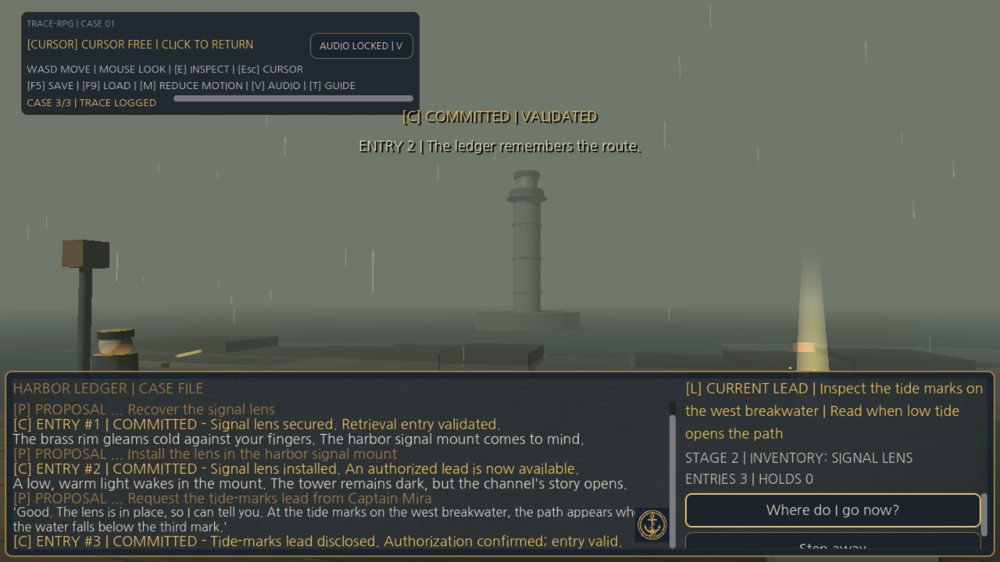 | 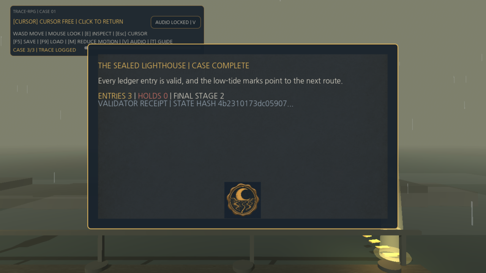 |

네 1280×720 파일은 최신 엔지니어링 작업 캡처이며 불변 연구 근거가 아니다. 검토 대기 콘셉트
후보는 Web/`--public-safe`에서 제외된다. 현재 로컬 빌드는 절차 월드·VFX·음향 위에 큐레이션
Higgsfield UI와 검증된 추적 Higgsfield 플레이어 GLB의 `Idle`/`Casual_Walk`을 사용한다. 애니메이션은
프레젠테이션 전용이며 정식 상태나 저장 데이터를 바꾸지 못한다.
평가는 저자 fixture와 프레젠테이션 불변조건 적합성만 입증한다. G4, 사용성, 몰입, 정서,
플레이어 효능, 확증 모델 효능은 **UNASSESSED**다. 2026-08-29/30 현재 영문 Web 빌드에서
전체 결말, 페이지 새로고침을 통과한 save/reload, symbolic hash를 바꾸지 않는 추락 복구,
추적 플레이어 로드, ASCII-safe 안내 3면, 콘솔·페이지 오류 0건을 확인했다. 프로덕션 배포
`dpl_GpRiuFSFGPrbbVMmFsPdPq731f9Y`도 데스크톱 시작 → 인게임 → Field Guide 스모크에서
콘솔·페이지 오류 0건을 기록했다. 프로덕션 save/reload, 현 배포 모바일 검증, 사람 제스처
포인터 잠금·음향, warmed frame/input, 30분 soak, rollback 근거가 없어 G6는 `FIX`다.

```bash
./scripts/build_godot_web.sh
python3 -m http.server 4173 --directory game-track/web/public
```

현재 영문/큐레이션 플레이어 산출물은 배포됐다: manifest 파일 11개 / 50,745,187바이트,
PCK 10,892,412바이트, SHA-256
`29e3d8b6b898482fb1a7979966cf1acec88caf7578a26398e889fc7af10f8f76`.
배포 상태: **[Vercel `dpl_GpRiuFSFGPrbbVMmFsPdPq731f9Y` READY](https://sealed-lighthouse-trace-rpg.vercel.app)**.
현재 전체 경로 플레이 영상: **[Compresso 압축 H.264 MP4](game-track/godot/docs/latest/trace-rpg-gameplay.mp4)**
(`1280×720`, 30 fps, 69.067초, 5,662,128바이트, SHA-256
`aa374c5aa9d03e0ab2822b83638e4c6645c7c9fda6c07e858051254c244b7044`). 위 배포와 바이트가
일치하는 로컬 빌드에서 캡처했으며 사용성·성능 근거가 아닌 엔지니어링 시연이다.
공개 런타임 파일 10개는 모두 `200`이며 로컬 바이트와 일치했다. `vercel.json`은 배포 설정으로
소비되므로 공개 자산이 아니다.
2026-08-17에 `dpl_7DN4fLqmGa8DfKeiQamVrkXgpEoe`를 대상으로 실행한 헤드리스 브라우저 스모크에서
정상 로딩, 한글 글리프, 1280×720·390×844 반응형 배치, 콘솔·페이지 오류 0건을 확인했다.
Playwriter는 같은 날 Vercel 기기 승인 로그인과 포인터 잠금 재시험 1회에만 사용했고 그
재시험에서는 잠금이 발생하지 않아 포인터 잠금은 **미확인**이다. 자동화 거부 자체는 결함
근거가 아니며, 남은 항목은 사람 제스처 확인이다. 상세 안내는
[`game-track/web/README.md`](game-track/web/README.md)에 있다.

## 다음 실행 순서

1. 파일럿으로 시나리오 난이도, 검증기 누락률, 인간평가 분산을 추정한다.
2. 분석계획과 1차 지표를 동결하고 검정력 분석 후 표본 수를 확정한다.
3. 10개 모델을 저비용으로 스크리닝하고 사전 정의된 Pareto 규칙으로 3개를 승격한다.
4. 3개 모델 × 6개 시스템군 × 3개 트랙의 확증 실험과 절제 실험을 수행한다.
5. 독립 평가를 통과하고 assignment-complete하며 outcome이 분류된 실행만 논문 결과에 반영한다. Proposal outcome이 존재하면 완전한 trace를 요구하되, proposal trace가 생성될 수 없는 분류된 terminal failure도 denominator에 유지한다.
