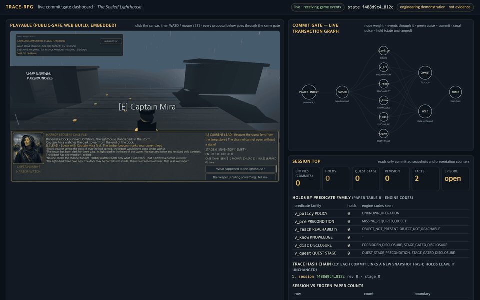

# TRACE-RPG 연구 패키지 2026

**TRACE-RPG**는 인터랙티브 게임 세계의 생성 이벤트를 위한 trace 연결 심볼릭 커밋 게이트다.
언어 모델은 퀘스트, 대화, 세계 변화를 *제안*할 수 있지만, type-strict parser, 외부에서 공급된
행동 정책, 그리고 여섯 개의 결정론적 상태 상대 술어가 받아들이기 전까지 그 어떤 것도 정식 게임
상태가 되지 않는다. 거부된 후보는 제한된 반례 유도 수리를 한 번 받고, 그 밖의 모든 경우는 변경
없는 이전 상태로 되돌아가며, 모든 종단 결과는 체크섬으로 연결된 재생 가능한 trace에 기록된다.


*플레이 영상.* 위 GIF(560×315, 8 fps, 1.5배속)는
[`trace-rpg-gameplay.mp4`](game-track/godot/docs/latest/trace-rpg-gameplay.mp4)(1280×720, 30 fps,
63.433초, 1,903 프레임)에서 만들었다. 2026-09-02에 Godot 4.7.1 Movie Maker로, 현재 로컬 빌드의
일회용 복사본 위에서 개발 전용 `--autoplay --public-safe` 경로를 통해 녹화했다. 오토파일럿은
키보드·마우스 입력을 대신할 뿐이며 플레이어가 누르는 것과 같은 상호작용·선택 핸들러를 구동하므로,
정식 상태는 proposal router를 통해서만 바뀌었다: commit 3, hold 1, 종단 SHA-256
`4b2310173dc059071fdc98e7705608d383dda81559706c3dd33bc96983108892` — headless 스모크가 보고하는
해시와 동일하다. 이는 엔지니어링 시연이지 usability·지연·G4·G6 근거가 아니다. 공개 Web 빌드
[sealed-lighthouse-trace-rpg.vercel.app](https://sealed-lighthouse-trace-rpg.vercel.app)은 이전 배포
`dpl_Auzz4gjVUcgDcL45EjcRG2HVyoCW`이며, 녹화에 보이는 게이트 라인과 기여 readout 이전 버전이다.

> 상태: 사용자가 Stage 6 모의 Major Revision 심사에서 나온 개정 방향을 수용했다. 확장 주장 충실성
> 감사와 guided-repair clean tagged input 재캡처가 통과하여 F6 재현성 gate는 종결됐지만, 별도
> G4/G6 게임 gate는 종결되지 않았다. 이는 저널 결정, 논문 게재 승인, 심사 archive 또는 DOI deposit이
> 아니다. 확증 효능 결과는 아직 없으며 `C-RESULT-001`–`005`는 `TODO-RESULT`다. 단일 모델 RQ2
> 스크리닝 패킷은 결정론적 작성 fixture count와 분리해 `pilot-only`로만 보고한다.

## 근거 지도

| 레인 | 현재 근거 | 정직한 경계 |
|---|---|---|
| E1 · 결정론적 오프라인 파일럿 | 단일 작성 세계의 parser, validator, repair, replay, integrity, accounting fixture; gate `13/13`, 해당 class에서 guided repair `5/5`, fault `10/10`, guard `3/3`; 2026-09-02 바이트 동일 재현([영수증](research/academic-pipeline/stage-04-replication-2026-09-02.md)) | 인코딩된 필드의 mechanism 적합성만 지지 |
| E2 · 라이브 RQ2 스크리닝 | hosted proposer 하나; 의도적으로 수리 가능한 policy-blind 셀에서만 guided `5/5` 대 blind `0/5`; noncommit `15/15` 상태 격리 | `C-PILOT-007/008`만 지지, 모집단·모델 순위·`C-RESULT-003` 승격 없음 |
| E3 · KG/온톨로지 시뮬레이션 | OKF node 43개, reference edge 106개, curated typed edge 24개, 온톨로지 위반 0, 작성 holdout 6/6 | closed-world `simulation-only`, 런타임 검색·의미 완전성 아님 |
| ENG1 · Godot/Web 엔지니어링 | fixture 4/4, combined check 52/52, 프로덕션 스모크 8/8, 밸런스 archetype 5/5, 추적 플레이어, 스크립트 골든패스 녹화 | 작성 fixture·presentation 적합성, usability·재미·G4·최종 G6 아님 |
| 확증 연구 | 미실행 | `C-RESULT-001`–`005`는 `TODO-RESULT` 유지 |

기여도 C1–C5, 55개 레퍼런스의 9개 선행 주제, 세 실험 레인과 엔지니어링 레인은
[`contribution-reference-crosscheck.md`](research/academic-pipeline/contribution-reference-crosscheck.md)에서
함께 교차검증하며, 어느 하나라도 어긋나면 CI가 실패한다. 원고에는 이 매트릭스에서 생성한 두 표(기여 ×
선행 주제 × 레인 × 추론 상한, 실험 레인 × 설계 × 단위 × 비교 × 상한)가 들어가고, commit된 guided-repair
사례마다 Table-ρ edit으로 해소한 validator code를 명시하며, 게이트와 수리 연산자의 archival 계보
(ASPLOS 2006 CEGIS, NeurIPS 2023 Self-Refine/Reflexion, ACM CSUR 1983 트랜잭션, ICML 2024 LLM-Modulo,
CoRL 2022 SayCan)를 직접 인용한다.

## 논문 한눈에 보기

정본 source: [`paper/latex/en/main.tex`](paper/latex/en/main.tex) ·
[`paper/latex/ko/main.tex`](paper/latex/ko/main.tex) — 현재 PDF:
[`English`](paper/latex/en/main.pdf) · [`한국어`](paper/latex/ko/main.pdf)

| 항목 | 값 |
|---|---|
| 제목 | TRACE-RPG: 인터랙티브 게임 세계의 생성 이벤트를 위한 trace 연결 기호 커밋 게이트 |
| 목표 venue | IEEE Transactions on Games, **Short Paper** (6–8쪽 밴드) |
| 현재 PDF 분량 | EN 8쪽 · KO 8쪽; 둘 다 live-screening·KG-simulation addendum을 포함하고 쪽수 밴드, Type 3 font, LaTeX log gate를 통과 |
| 기여 | C1 버전형 신뢰경계 contract · C2 validate–repair–commit controller · C3 감사 연결 근거 계층 · C4 assignment-complete 적합성 harness · C5 반례 유도 수리 연산자 ρ(a,E) |
| 참고문헌 | 55건 — `VERIFIED` 46 + `PREPRINT` 9, 미일치·환각 0; 2026-09-02에 모든 DOI/URL을 다시 해석하고 제목을 대조([링크 감사](research/academic-pipeline/stage-05-link-audit-2026-09-02.md)); Semantic Scholar 조회 22건은 rate-limited로 기록 |
| 심사 모델 | 이중 익명 |

논문이 주장하는 것과 명시적으로 주장하지 않는 것:

| 주장함 | 주장하지 않음 |
|---|---|
| state, policy, candidate, record의 typed contract | 특정 모델이 다른 모델보다 낫다는 것 |
| 인코딩된 12개 code 위의 결정론적 상태 상대 커밋 게이트 | 플레이어 경험이나 서사 품질 |
| 변경 없는 상태 fallback을 갖춘 제한 수리 | 참조 수리기가 배포 가능한 방법이라는 것 |
| 내용 연결 record, 의미적 replay, 에피소드 연속성 | 작성자 인증 (체크섬은 unkeyed) |
| assignment-complete failure accounting | 검색·메모리·감정의 효익 |
| **단일** 작성 world state의 적합성 | 실제 규모 게임으로의 일반화 |

주장 원장([`research/claim-ledger.yaml`](research/claim-ledger.yaml)), 21개 주장:

| 상태 | 개수 | 의미 |
|---|---:|---|
| `verified-designed-fixture` | 6 | 동결 작성 fixture에서 관찰 |
| `verified-primary` / `-scope-limited` / `-preprint` | 4 | 인용 문헌이 지지 |
| `verified-authored-engine-fixture` / `-render-fixture` | 2 | Godot 슬라이스 적합성 |
| `pilot-only` | 2 | 모집단 승격 없는 단일 모델 라이브 스크리닝 근거 |
| `approved-design-protocol` | 1 | 설계 승인, 미실행 |
| `proposed-contribution` | 1 | 아키텍처 입장 |
| **`TODO-RESULT`** | **5** | **`C-RESULT-001`–`005`: 확증 효능 결과 없음** |

두 PDF는 `make -C paper/latex all`로 재빌드·검증한다. 빌드는 SVG 원본을 유지하고 source 연결
벡터 PDF로 변환하며, 쪽수, Type 3 font, 누락 글리프, 미정의 참조, 인용, overfull box 회귀를 거부한다.

## 시각 자료

여섯 개 SVG는 모두 `scripts/generate_readme_visuals.py`가 생성한다. V2 하단, V3, V4는 동결된 파일럿
CSV와 주장 원장에서 직접 읽으므로 원본 수치와 어긋날 수 없다. 실선은 구현되어 파일럿에서 실행된
요소이고, 점선은 명세만 있고 근거가 없는 미구현 요소다. 이중언어 [편집 가능 시각 자료 계약](visuals/README.md)과
[기계 판독 원본 매니페스트](visuals/source-manifest.json)는 모든 렌더 그림·표를 생성기, 편집 원본,
데이터에 연결한다.

### V1 · 신뢰 경계


제안자는 감정 추정 `z_t`, 그래프 검색, 시간 메모리를 관찰할 수 있으나 이들 중 어느 것도 커밋 권한을
갖지 않는다. 정식 상태는 게이트를 통과한 `T(c_t, a_t)`로만 바뀐다. 인코딩된 유효성은 인코딩된 술어에
한한 유효성이며, 공유 candidate-key 계약은 proposal과 replay 양쪽에서 알 수 없는 최상위 field를 거부한다.

### V2 · 단일 트랜잭션


예산 안에서 어떤 후보도 검증을 통과하지 못하면 정식 상태는 그대로 유지된다. 최초 후보가 실패해도
수리 후 commit될 수 있으며, 완료된 candidate attempt는 종단 결과 전에 모두 기록된다. 하단 repair arm
수치는 `repair-arm-summary.csv`에서 읽는다.

### V3 · Stage 4 오프라인 파일럿 관찰값 전체


각 행의 분모는 그 행에 한정된 설계 사례 수이며 행 간 비교는 성립하지 않는다. `0/2`와 `5/7`은 설계된
결과이지 회귀가 아니다. 신뢰구간, 유의성 검정, 인과 비교는 주장하지 않는다.

### V4 · 주장 원장 상태


설계 fixture 근거는 효능 주장으로 승격되지 않는다. 상류 trace나 분석 해시가 바뀌면 검증 상태는 취소된다.

### V5 · 학술 파이프라인 진행 상태


원래 Stage 4.5의 `22/22` 통과 판정은 대체된 감사 기록으로만 보존한다. Stage 6에서 주장 결함 3건과
감사 범위 밖의 본문 telemetry 결함 1건을 재현했고, Stage 8에서 원고와 parser 계약을 수정했으며 확장
감사는 주장 family 42/42를 통과했다. Stage 5에는 미일치·환각 0건의 교차검증 참고문헌 55건(`VERIFIED`
46, `PREPRINT` 9)이 있다. Stage 10은 선언 입력 22/22, 산출물 38/38, provenance row 121개를 clean
guided-repair release tag에 결합한다. 독립 효능 실험과 저널 투고는 아직 남아 있다. 상세 내용은
[`stage-04.5-claim-faithfulness-gate.md`](research/academic-pipeline/stage-04.5-claim-faithfulness-gate.md)와
[`stage-08-revision.md`](research/academic-pipeline/stage-08-revision.md)에 있다.

### V6 · 계획된 확증 설계 (미실행)


## 핵심 연구 질문과 아직 없는 것

- RQ1: 심볼릭 커밋 게이트가 모델 크기와 무관하게 불가능한 세계 상태와 정보 누설을 줄이는가?
- RQ2: 반례/unsat-core 기반 수리가 단순 재시도보다 유효 상태를 더 효율적으로 복구하는가?
- RQ3: 지식 그래프 검색과 시간 메모리가 장기 대화 일관성을 높이면서 서사 다양성을 보존하는가?
- RQ4: 불확실성 보정된 감정 신호가 하드 유효성을 악화시키지 않고 목표 긴장 곡선 추종을 개선하는가?
- RQ5: 동일 컨트롤러의 이득이 10개 모델 스크리닝과 3개 모델 확증 단계에서 재현되는가?

각 질문은 하나의 `C-RESULT-*` 주장에 대응하며, 다섯 개 모두 아직 `TODO-RESULT`다.

| 질문 | 현재 존재하는 것 | 아직 없는 것 |
|---|---|---|
| 코드가 동작하는가? | 예 — 전체 pytest 181 passed, 81 subtests; unittest discovery 138 passed; 결정론적 파일럿, Godot 슬라이스, 공개 안전 Web 빌드, 스크립트 골든패스 녹화 | — |
| 파이프라인이 완료됐는가? | Stage 10까지의 저장소 단계 산출물은 최종 영문·국문 PDF 재빌드와 형식 검사를 포함해 완료 | 독립 효능 실험, 저널 투고, 심사 결정은 남아 있음 |
| 논문이 작성됐는가? | 예 — 이중언어 IEEE source와 8쪽 PDF, 링크 감사를 마친 참고문헌 55건, ρ(a,E) 유도 수리, 별도 live-screening/KG-simulation addendum | 저널 투고, 심사, 그 결과에 따른 개정은 남아 있음 |
| **연구 주장이 입증됐는가?** | **아니오** | 셀당 5회 RQ2 스크리닝 파일럿만 존재하며, 확증 다중 모델·인간·감정·검색·메모리·엔진 성능 연구는 없다 |

현재 적합성 주장을 뒷받침하는 구현은 완료됐다. 그러나 **확증 실험은 완료되지 않았다.** 추적 중인
21개 주장 가운데 5개는 승격 요건을 만족하는 근거가 없는 효능 주장이며, 그 5개가 바로 연구 질문이 묻는 대상이다.

## 실험 설계 (계획, 미실행)

SSOT: [`configs/experiment-matrix.yaml`](configs/experiment-matrix.yaml). 이 확증 matrix는 실행되지
않았고 별도 RQ2 스크리닝 파일럿이 이를 대체하지 않는다.

| 차원 | Stage 1 스크리닝 | Stage 2 확증 |
|---|---|---|
| 모델 | 10개 (전체) | 3개 (동결 Pareto 규칙으로 승격) |
| 트랙별 시나리오 | 30 | 120 |
| 반복 | 3 | 5 |
| 컨트롤러 arm | 6 | 6 |
| Grounding 변형 | 3 (`none`, `rag`, `kg_temporal_memory`) | 3 |
| Affect 변형 | — | 2 (`off`, 불확실성 보정) |
| Ablation | — | 6 |
| 목적 | Pareto 선별, **인과 결론 없음** | 사전등록 완전 요인 설계 |

| Arm | 게이트 | 수리 | Grounding 스택 |
|---|---|---|---|
| `direct_commit` | 없음 (안전하지 않은 baseline, 격리 빌드) | — | — |
| `structural_constraint_only` | schema/grammar만 | — | — |
| `validator_rejection_only` | 상태 상대 | 없음 | — |
| `matched_budget_blind_retry` | 상태 상대 | 오류 피드백 없는 K개 새 제안 | — |
| `structured_repair` | 상태 상대 | 구조화 오류를 사용한 K회 수리 | 부분 |
| `trace_rpg_full` | 상태 상대 + 외부 정책 | K회 수리 + 방어 재검증 | 전체 |

| 트랙 | 1차 평가지표 |
|---|---|
| `world-generation` | `valid_episode_rate` |
| `npc-dialogue` | `hard_dialogue_violation_rate` |
| `affect-adaptation` | 하드 유효성 회귀 없는 `target_curve_rmse` |

통제: seed `11, 23, 47, 83, 131`; 수리 예산 `K=3`; 60초 timeout; 비교 가능한 세 arm에서 동일하게
최대 4회의 proposal-or-repair 호출; 시도별 토큰, 지연, 비용, failure class 기록. 28개 지표는
[`configs/metric-catalog.yaml`](configs/metric-catalog.yaml)에 정리되어 있다.

## Stage 4 논문과 제한 파일럿

오프라인 표는 `research/academic-pipeline/stage-04-pilot/pilot-results.json`에서 생성한다: 인코딩된
오류 코드 12종에 대한 gate 일치 `13/13`; 무효 수리 사례 12건은 guided-repairable 5, oracle-only 1,
irreparable 6으로 분할; blind commit `0/12`, 도달 가능 class에서 guided commit `5/5`, oracle commit
`5/5` + `1/1`; 검출 가능 integrity fault `10/10`; 선언된 repair-provenance 경계 replay 허용 `1/1`;
adapter 결과는 7건 중 commit 1, 기호 fallback 1, 분류된 failure 5; assignment guard `3/3`. 이는 raw
작성 fixture count이지 live model·플레이어·모집단 효능 추정이 아니다. 2026-09-02에 같은 runner가
격리 디렉터리에서 모든 CSV를 바이트 동일하게 재현했다.

별도 생성 live-screening 표는 추적 중인 `research/academic-pipeline/rq2-live-pilot/` 패킷만 읽는다.
구성된 `signal-repair-v2` blind 셀(`K=1`)에서 guided repair는 `5/5`, blind retry는 `0/5` commit했고,
다른 현재 셀 4개는 guided 우위를 보이지 않았으며, 현재 noncommit arm 결과 `15/15`가 이전 상태를
보존했다. 이는 `screening-pilot-only`이며 `C-RESULT-003`은 `TODO-RESULT`로 남는다.

guided-repair 재캡처는 tag `trace-rpg-guided-repair-inputs-20260821-v1`과 `dirty=false`를 기록한다.
선언 입력 22개와 산출물 해시 38개가 모두 재계산되고, provenance row 121개는 실행 fixture row 85 +
집계 row 36으로 유지된다. 이것이 F6을 종결하며, 심사 archive나 DOI deposit은 주장하지 않는다.

## KG/온톨로지 그래프 저장소와 제안 시뮬레이션

세 가지 의미를 분리한다: 형제 Graphify 산출물은 문서 탐색 색인이고, Python `WorldState`는 하드
런타임 권위이며, SQLite 파일은 저장소 로컬 **methods-graph mirror**일 뿐이다. 닫힌 응용 온톨로지는
node type 21종, relation type 13종, domain/range 규칙, validator 술어 매핑 6개, source-scoped 실행
가능 competency question 6개를 선언한다. OWL/SHACL이 아니며 런타임 그래프 검색을 구현하지 않는다.


`SL-KG-ONTOLOGY-SIM-001`은 작성 query 6개 × 후보 5개에 고정 전략 7종을 실행한다: 전략당 후보
점수 30개, 총 210개. 선택 링크 $S_q$와 query당 동결 관련 링크 $G_q$ 하나에 대해
$P=TP/(TP+FP)$, $R=TP/(TP+FN)$, $F_1=2PR/(P+R)$, 현실적 tie rank의 $MRR=|Q|^{-1}\sum_q r_q^{-1}$,
$BS=N^{-1}\sum_i(s_i-y_i)^2$, $Sem@K=(K|Q|)^{-1}\sum_{q,i}I[domain/range\ valid]$를 계산한다.
ratchet은 recall ≥0.80, coverage ≥0.95, `Sem@3=1`, 엄격한 사전식 개선을 모두 만족할 때만 전략을
유지한다. 현재 패킷: **OKF node 43, reference edge 106, curated typed edge 24, 온톨로지 위반 0,
competency question 6/6**; 유지된 `S2-typed-lexical-loose` 전략은 작성 holdout 6/6을 회수했다
(`P=R=F1=1.000`, 현실적 tie `MRR=0.944`, `BS=0.131`, `Sem@3=1.000`). 이는 closed-world 구성 결과이며
의미적 진리, 유용성, 런타임 KG 효능, 어떤 `C-RESULT-*` 주장의 근거도 아니다.

```bash
PYTHONDONTWRITEBYTECODE=1 uv run python scripts/run_kg_ontology_simulation.py
PYTHONDONTWRITEBYTECODE=1 uv run python scripts/run_kg_ontology_simulation.py --check
```

산출물: [JSON matrix](research/simulation/kg-ontology/latest/evaluation-matrix.json),
[공식/전략 보고서](research/simulation/kg-ontology/latest/evaluation-matrix.md),
[TSV 시행](research/simulation/kg-ontology/latest/strategy-trials.tsv),
[권고](research/simulation/kg-ontology/latest/recommendations.json), SVG, 이중언어 생성 TeX, 해시,
무시되는 런타임 SQLite mirror. 기계 온톨로지는
[`knowledge/ontology/trace-rpg-ontology.json`](knowledge/ontology/trace-rpg-ontology.json)이다.

## 실험 게임 트랙: *The Sealed Lighthouse*

*The Sealed Lighthouse*는 8–12분 목표의 턴제 서사 조사 micro-RPG다. 1차 계획 실험은 구조화 텍스트와
정식 상태를 사용하며, 별도로 표시된 2차 VLM/UI 트랙은 검토·체크섬 고정된 파생물을 나중에 사용할 수
있다. 큐레이션된 Higgsfield UI·플레이어 자산은 presentation 레인에서만 출하되며 실험 입력이나 정식
상태에 들어가지 않는다. [`game-track/design/gdd.ko.md`](game-track/design/gdd.ko.md),
[`game-track/design/paper-crosswalk.ko.md`](game-track/design/paper-crosswalk.ko.md),
[`configs/experimental-game.yaml`](configs/experimental-game.yaml)에서 시작한다. 참여자는 모집되지
않았고 개인 telemetry나 인간 결과는 존재하지 않는다.

### Cycle 3 공개 안전 플레이어블

Godot 4.7.1 플레이어블은 3인칭 항구 탐색, 제안 게이트 상호작용, 반응형 영문 원장 UI, reduced
motion, 풀링된 절차적 VFX, 제스처 게이트 절차적 오디오, `Idle`/`Casual_Walk`를 갖춘 추적 플레이어
리그를 더한다. 서사 보상은 항구 신호 복구와 조석 경로 획득이며, 앞바다 등대는 봉인된 채 남는다.

원장은 논문의 커밋 게이트를 게임 안에서 그대로 비춘다. 모든 hold는 그것을 막은 상태 상대 술어 family를
명시하고(`[V] GATE DISCLOSURE | state unchanged`) 규칙을 가르치며(`RULE LEARNED` / `RULE RECALLED`);
모든 commit은 `CONTRIBUTION #N` + `UNLOCKED`를 게시하고 `CASE CHAIN` HUD 줄을 전진시키며; 엔드 카드는
`ENTRIES`, `HOLDS`, `HOLDS BY GATE`, validator 상태 해시를 보고한다. 이 readout은 presentation 전용으로,
하드 writer가 반환하는 두 snapshot과 작성된 label 표에서만 파생되며 두 번째 상태 모델을 두지 않는다.

| `SL-PLAY-EVAL-001` 행 | 검사 | 결과 |
|---|---:|---|
| 정식 fixture | `10/10` | PASS |
| 중복 이벤트 fixture | `10/10` | PASS |
| timeout fixture | `10/10` | PASS |
| 손상 저장 fixture | `10/10` | PASS |
| presentation 불변량 | `12/12` | PASS |
| **합계** | **`52/52`** | **PASS** |
| 공개 안전 3D 스모크 | `8/8` | PASS, 종단 SHA-256 `4b231017…108892` |
| archetype 밸런스 probe | `SL-BALANCE-PROBE-001` 5/5 | PASS |

[`SL-PLAY-EVAL-001`](game-track/godot/docs/latest/evaluation-matrix.md)과
[JSON 기록](game-track/godot/docs/latest/evaluation-matrix.json)을 참고한다.

| 도착 | 거절 (게이트 라인) |
|---|---|
|  |  |
| 승인된 단서 | 엔딩 영수증 |
|  |  |

이 네 개의 1280×720 파일과 위 녹화는 엔지니어링 작업 캡처이지 불변 연구 근거가 아니다. G4,
usability, 몰입, 감정, 플레이어 효능, 확증 모델 효능은 **UNASSESSED**다. G6는 프로덕션 저장/복원,
현재 모바일 검증, 인간 제스처 포인터/오디오 검사, 예열된 frame/input, 30분 soak, 롤백 근거가 나올
때까지 `FIX`로 남는다.

```bash
./scripts/build_godot_web.sh                       # 일회용 복사본 Web export
python3 -m http.server 4173 --bind 127.0.0.1 --directory game-track/web   # /public/ = 게임, /dashboard/ = 라이브 대시보드
uv run python scripts/run_playable_evaluation.py   # 일회용 복사본에서 SL-PLAY-EVAL-001
```

#### 라이브 커밋 게이트 대시보드



[`game-track/web/dashboard/`](game-track/web/dashboard/README.md)는 공개 안전 Web 빌드를 임베드하고, AgentSight의
관용구(효과 가중 노드, 애니메이션 리플레이, 라이브 `top` 표)로 게임이 게이트에 통과시키는 모든 제안을 그린다. 녹색
펄스는 proposer → parser → 여섯 술어 family → COMMIT → TRACE로 흐르고, 코럴 펄스는 항목을 막은 family에서 멈춰
HOLD → TRACE로 가며 상태 해시는 변하지 않는다. 세션 패널은 entries, 엔진 code가 붙은 술어 family별 hold, trace 해시
체인(C3), 그리고 라이브 세션 옆의 동결 E1/E2 count를 보여준다. 게임은 임베드된 경우에만
`window.parent.postMessage`로 typed event를 미러링하며, 페이지는 게임으로 되돌아가는 채널이 없고 봉인된 fact ID를
받지 않는다. 2026-09-02 브라우저 구동 경로는 commit 3, hold 1(`FORBIDDEN_DISCLOSURE` → DISCLOSURE), 해시 체인
`f488d9c4…812c → 19b474dc…c498 → 93381457…b900 → 4b231017…8892`를 만들었고, headless 스모크가 보고하는 종단
해시와 같은 값으로 끝났다. 엔지니어링 시연일 뿐이며 어떤 claim, G4, G6 상태도 승격하지 않는다.

배포: **[`dpl_Auzz4gjVUcgDcL45EjcRG2HVyoCW` Vercel READY](https://sealed-lighthouse-trace-rpg.vercel.app)**
(PCK 10,893,980 bytes, SHA-256 `654c1f136de9e15b37be4d697daf863dccf20d1a59287ae86f635d0d7e1a58e7`);
공개 런타임 파일 10개 모두 익명 `200` 응답이며 로컬 바이트와 일치했다. 게이트 라인, 기여 readout,
autoplay 경로를 포함한 현재 로컬 빌드는 재빌드됐지만 아직 재배포되지 않았다. 포인터 잠금은 자동화로
**검증되지 않았으며** 인간 제스처 검사로 남는다. [`game-track/web/README.md`](game-track/web/README.md) 참고.

## 빠른 시작

```bash
uv sync --extra research --extra dev
uv run python -m unittest discover -s tests -v
uv run python scripts/validate_project.py
uv run python scripts/validate_contribution_crosswalk.py
uv run python scripts/validate_visual_assets.py --require-pdf-tools --check-regeneration
./scripts/validate_game_track.sh
uv run python examples/recorded_experiment.py
./scripts/verify_like_ci.sh                        # CI 단계 전부를 순서대로
```

선택적 로컬 LLM 접근은 공식 Codex device-code 흐름을 사용한다. 래퍼는 자격 증명을 읽거나 출력하지
않고, 각 prompt를 일회용 읽기 전용 workspace에서 임시로 실행하며, 비권위적 soft proposal만 반환한다.
공개 Web 빌드에는 포함되지 않으며 정식 게임 상태를 커밋할 수 없다.
[`docs/codex-oauth-llm.ko.md`](docs/codex-oauth-llm.ko.md) 참고.

## 구조

| 경로 | 목적 |
|---|---|
| `paper/latex/en`, `paper/latex/ko` | 정본 영문·국문 IEEE 원고와 PDF |
| `paper/en`, `paper/ko` | 대체된 향후 확증 프로토콜 청사진 |
| `configs/` | 모델 10개, 처치, 시나리오, 지표의 SSOT |
| `src/nesy_game/` | 결정론적 contract, validator, 수리 연산자, 런타임 |
| `game-track/` | 엔진 중립 contract, 이중언어 GDD, Godot 슬라이스, Web export 설정, 공개 자산 제외 기록 |
| `_workspace/current/` | 단일 live 게임 스튜디오 production·design·engineering·QA·UI·ops workspace |
| `research/` | 불변 source, Scrapling 캡처, 학술 파이프라인, 근거·주장 원장 |
| `harness/` | 에이전트 역할, workflow, 검증 gate |
| `../llm-wiki/` | 프로젝트 wiki와 Graphify 지식 그래프 |
| `visuals/` | README SVG 원본과 편집 가능 시각 자료 계약·원본 매니페스트 |
| `scripts/` | validator, 파일럿 runner, 논문 그림·표·README 시각 자료 생성기 |

## 재현성 경계

- LLM/VLM은 후보나 soft signal을 제안할 뿐 정식 세계 상태를 구성하지 않는다.
- SMT/규칙 검사는 인코딩된 제약만 보장한다. 의미적 false negative는 별도로 측정한다.
- 합성 플레이어와 autoplay 경로는 스트레스 테스트·시연 도구이지 인간 경험의 근거가 아니다.
- 원본 source와 실행 trace는 불변이며, 논문 표는 trace ID에서 생성해야 한다.
- “open weight”를 “open source”의 동의어로 취급하지 않으며, 모든 모델은 명시적 license·정책 기록을 유지한다.

## 목표 저널과 실행 순서

1차 후보는 **IEEE Transactions on Games**, 방법론 우선 대안은 **Knowledge-Based Systems**다. 제출
직전 Clarivate Master Journal List에서 SCIE 여부를 다시 확인해야 한다. 저널 수준 주장은 사전등록된
1차 평가지표, 파일럿 기반 검정력 분석, 세계·퀘스트 템플릿 홀드아웃, 혼합효과모형, 효과크기와 95%
신뢰구간, 다중비교 보정, 독립 인간 평가, 실패 분석, assignment-complete outcome record를 요구한다.
상세 투고 게이트: [`research/journal-targets.ko.md`](research/journal-targets.ko.md).

1. 시나리오 난이도, validator 누락률, 인간 평가 분산을 파일럿한다.
2. 분석 계획과 1차 평가지표를 동결하고 검정력 분석으로 표본 크기를 정한다.
3. 모델 10개를 저비용으로 스크리닝하고 사전등록 Pareto 규칙으로 3개를 승격한다.
4. 확증 3-모델 × 6-시스템 × 3-트랙 실험과 ablation을 실행한다.
5. 독립 감사를 거친 assignment-complete·outcome-classified 실행만 인정하고, proposal outcome이 존재하면 완전한 trace를 요구하되 proposal trace가 존재할 수 없는 분류된 terminal failure는 보존한다.
