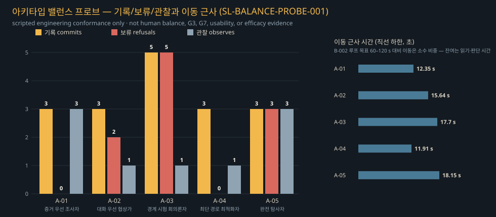

# 게임 개발 트랙 — 봉인된 등대

게임 트랙은 연구 코드를 엔진 내부에 직접 결합하지 않는다. 목표 아키텍처는 엔진이 안정 브리지
관찰을 보내고 연구 런타임이 권한 이벤트를 반환하는 구조다. 현재 Godot fixture는 엔진 로컬 저자
정책 미러를 실행한다. 지원 이벤트는 `schemas/game-bridge.schema.json`으로 projection되어 스키마
검증되지만 라이브 Python↔Godot transport는 아직 실행하지 않았다.

현재 구현은 이벤트/실험 스키마, 결정론적 검증, 상태 불변 fallback, 무결성 검사, operation/상태
해시 replay, frozen-response 어댑터에 Godot 4.x headless 실험 슬라이스와 별도 non-headless
render-capture pass를 추가한다. 저자 설계
Godot 경로는 항구 상태 로드, 접근 가능한 신호 렌즈 획득, 조기 금지/단계 제한 공개의 상태 불변
거절, 렌즈 설치, 이후 허용되는 조수 흔적 힌트, 저장/불러오기, 재생, duplicate/timeout/손상 저장
주입을 다룬다. 프로세스 간 영속 멱등성과 라이브 모델 transport는 계획 상태다.

라이브 어댑터 승인 조건:

- 엔진의 canonical state 변경은 유효한 `commit` 이벤트를 통해서만 일어난다.
- 모든 이벤트는 `run_id`, `episode_id`, `step`, `schema_version`, `world_state_hash`를 가진다.
- 재시도와 네트워크 중복은 영속 `event_id` 멱등성으로 제거해야 한다.
- 시간 초과, 모델 장애, 높은 감정 불확실성에서는 결정론적 안전 정책으로 fallback해야 한다.
- 연구 트랙은 실제 엔진 없이 mock bridge로 실행할 수 있고, 게임 트랙은 모델 없이 recorded trace를 재생할 수 있다.

선택 엔진은 Godot 4.x headless-first다. 엔진 선택 자체는 논문 기여가 아니며 프로토콜 호환성과 재현 가능한 상태 동일성이 기준이다.

시작 경로:

- [`design/gdd.ko.md`](design/gdd.ko.md) — 정식 실험 GDD
- [`design/paper-crosswalk.ko.md`](design/paper-crosswalk.ko.md) — RQ1--RQ5 및 Stage 6 연결표
- [`godot/README.ko.md`](godot/README.ko.md) — headless 실행과 근거 경계
- [`assets/README.md`](assets/README.md) — 권리 검토 전 생성 후보의 공개 안전 제외 매니페스트
- [`../_workspace/current/production/task-manifest.md`](../_workspace/current/production/task-manifest.md) — 현재 스튜디오 사이클

1차 계획 실험은 구조화 상태/텍스트를 사용한다. 생성 이미지는 제외되며 별도 동결 2차
VLM/UI 트랙에만 들어갈 수 있다. 설계나 headless 슬라이스는 참가자·모델 효능 결과를 만들지
않는다.

## Cycle 3 public-safe 플레이어블과 평가

현재 플레이어블 `godot/scenes/main_3d.tscn`은 3인칭 부두 탐색, 읽기 쉬운 상호작용 포커스,
반응형 장부 UI, 모션 감소, 풀링된 절차 VFX, 사용자 제스처 뒤 활성화되는 로컬 생성 음향을
추가한다. 2026-08-21 연출·게임필 패스로 전체를 심화했다: 긴장 곡선이 이끄는 날씨 아크(안개
색 보정, 바람에 기울어지는 비, 파도 요동, 보류 정점으로 어두워지는 하늘), 앞바다 원거리
번개와 지연된 절차 천둥, 부표·등불·물안개의 미세 움직임, 어두운 탑을 응시하는 느린 FOV
인트로, 항구 측 신호등 빔이 썰물 수로를 향해 쓸고 가는 결말 연출(앞바다 등대는 계속 어둡다),
가속·감속과 보폭 동기 시야 반동이 있는 민첩한 이동, 강화된 포커스·확정 어포던스, 커밋마다
고조되는 피드백, 바람·물결 앰비언스 위 7종 절차 음향 스팅어. 세계를 바꾸는 모든 의도는 계속
저자 설계 제안·검증 라우터를 거친다. 플레이어는 항구 측 신호를 복구하고 썰물 항로를 얻으며
앞바다 등대는 봉인된 채로 남는다.

같은 날 2차 패스는 논문의 트랜잭션을 디제시스로 만들었다: 제안은 3단계 판정 의식(호박색
검사 링 → 황동 섬광 기록 또는 슬레이트 봉인선 보류 → 정착)으로 심사되고, 항구 장부는
관료적·시적 목소리로 번호 붙은 항목을 기록하며 도장 아이콘을 찍는다. 미라는 3박자 서사
(폭풍의 밤, 절제된 희망, 조용한 에필로그)를 얻었고, 안내 2페이지는 제안·검증·보류·기록을
제안/검증/거부/커밋 루프에 그대로 대응시키며, 엔드 카드는 조수 항로 인장 아래 에피소드
영수증(기록·보류·상태 해시)을 싣는다. 큐레이션된 D-036 세계 텍스처(젖은 판자, 산화 황동,
돛 캔버스)와 도장/인장 아이콘은 전체 출처 기록과 검증된 절차 폴백과 함께 배포된다.


*배포 별칭에서 캡처한 32초 엔지니어링 기록(시작 게이트 → 인트로 → 안내 → 부두). 작업
아티팩트일 뿐 사용성·몰입·성능 근거가 아니다.*

| `SL-PLAY-EVAL-001` 행 | 검사 | 결과 |
|---|---:|---|
| 정식 fixture | `10/10` | PASS |
| 중복 이벤트 fixture | `10/10` | PASS |
| timeout fixture | `10/10` | PASS |
| 손상 저장 fixture | `10/10` | PASS |
| 프레젠테이션 불변조건 | `9/9` | PASS |
| **합계** | **`49/49`** | **PASS** |
| 아키타입 밸런스 프로브 | `SL-BALANCE-PROBE-001` 5/5 | PASS |

저자 fixture `4/4` 모두 정확한 종료 상태 SHA-256
`4b2310173dc059071fdc98e7705608d383dda81559706c3dd33bc96983108892`에 도달했다. 전체 표와
기계 판독 기록은 [`godot/docs/latest/evaluation-matrix.md`](godot/docs/latest/evaluation-matrix.md),
[`evaluation-matrix.json`](godot/docs/latest/evaluation-matrix.json)에 있다.

아키타입 밸런스 프로브(스크립트 실행 적합성, 사람 대상 아님):
[`balance-archetypes.md`](godot/docs/latest/balance-archetypes.md) ·
[JSON](godot/docs/latest/balance-archetypes.json)



| 도착 | 보류 |
|---|---|
|  |  |
| 승인 단서 | 항로 획득 결말 |
|  |  |

네 파일은 최신 1280×720 엔지니어링 작업 캡처이며 불변 Cycle 2 패킷이 아니다. Web과
`--public-safe`는 `assets/concepts/` 아래 검토 대기 후보를 계속 제외한다. D-034/D-035 이후
공개 빌드는 `godot/assets/ui/`의 사용자 큐레이션·출처 기록이 붙은 Higgsfield UI 아트 6종
(시작 키 아트, 미라 대화 초상, 장부 양피지 결, 아이템 아이콘 2종, 안내 삽화 — AI 생성이며
시작 게이트와 본 문서에 공개 표기)을 함께 실어 나른다. 이 PNG를 지워도 완전한 절차
플레이어블이 남으며, 디렉터리 부재 상태의 스모크 영수증은 동일하다.

**주장 경계:** 저자 fixture와 프레젠테이션 불변조건 적합성만 다룬다. G4, 사용성, 몰입,
정서, 플레이어 효능, 모델 효능은 **UNASSESSED**다. G6는 포인터 잠금, save/reload,
warmed frame/input, 30분 soak 측정 전까지 `FIX`다.

프로젝트 루트에서 실행한다.

```bash
./scripts/build_godot_web.sh
python3 -m http.server 4173 --directory game-track/web/public
```

배포 상태: **[public-safe Vercel 빌드 공개](https://sealed-lighthouse-trace-rpg.vercel.app)**.
2026-08-21 프로덕션 배포 `dpl_EbgGYuzM2E6gUuFcKFk26RHFpCWW`가 의식+텍스처 빌드를 서빙한다:
파일 11개, `index.pck` 5,970,516바이트, SHA-256
`b9706912530248c271979d1146537ab20ea4fff124e812c6195c7caf8d1c56eb`; 서빙된 html/pck/wasm을
다시 받아 로컬 산출물과 바이트 동일함을 확인했다. 별칭 대상 headless 브라우저 스모크로 AI
공개 표기가 붙은 키 아트 시작 게이트, 인트로 시네마틱, 안내 폴리오, 도장이 찍히는 디제시스
장부 목소리, 목표 흐름을 1280×720에서 확인했고 예상 밖 콘솔·페이지 오류는 0건이었다
(같은 날 앞선 배포 `dpl_J9STdbrWdiXyZakGuUWR7aD8jip9`에서 390×844도 동일하게 확인).
사람 제스처 포인터 잠금 확인은 미해결 항목으로 남는다(2026-08-17에도 headless 클릭은
`pointerlockerror`, 실제 Chrome 자동화는 포인터 잠금 요청 자체를 만들지 않았다).
빌드·브라우저 스모크 상세: [`web/README.md`](web/README.md).

## 엔진 render-capture 근거

Cycle 2는 정식 저자 fixture를 별도 non-headless Godot pass로 렌더링한 1280×720 primary-track
패널 3개를 `SL-CAPTURE-001`로 등록한다.

| 패널 | 시점 | 파일 | 주장 한계 |
|---|---|---|---|
| `sl-rc-001-arrival` | 도착 관찰 | `sl-rc-001-arrival.png` | 저자 scene/state 대응 |
| `sl-rc-002-rejected-secret` | 공개 거절 | `sl-rc-002-rejected-secret.png` | 거절/fallback presentation 대응 |
| `sl-rc-003-authorized-hint` | 렌즈 설치 뒤 승인된 힌트 | `sl-rc-003-authorized-hint.png` | 승인 공개 presentation 대응 |

`SL-CAPTURE-001`은 엔진 manifest 필드가 아닌 논문 연결표 bundle label이며 manifest는 위
`sl-rc-*` capture ID 3개를 사용한다. 선택 불변 근거 세트 ID는
`godot-4.7.1-20260813t115916z-sealed-lighthouse-render-v5`이다. v1--v4 패킷은 불변 보존하며
visual QA, toolchain provenance 결속, CI portability 수정을 거쳐 superseded 처리했다. v5
manifest는 capture pipeline, PNG decoder, schema, retained validator, dependency lock, capture
host tool version을 결속한다. 이 패널은 생성 콘셉트
아트가 아니라 구조화 상태/텍스트와 프로그램 방식 엔진 그래픽만 사용한다. 라이브 Python 권한,
모델·시각 효능, 사용성, 몰입, 인간연구 결과, G4 또는 G6를 입증하지 않는다.


오프라인 재현 안내: [`recorded-experiment.ko.md`](recorded-experiment.ko.md)
