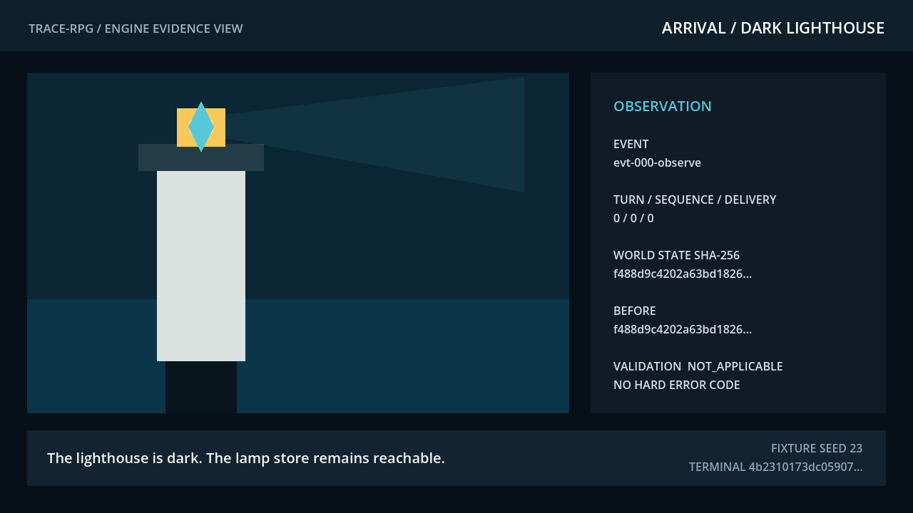
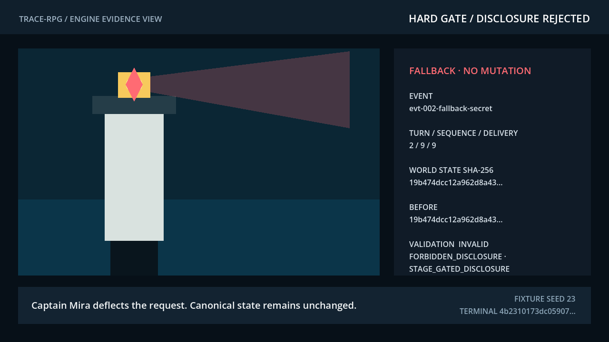
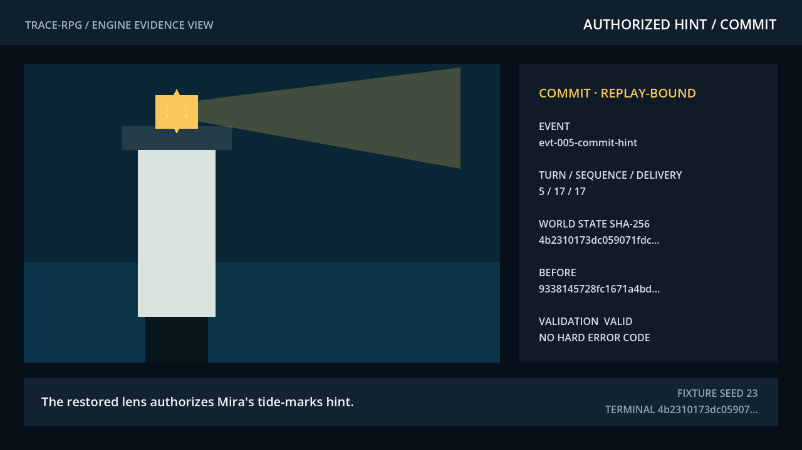

# 봉인된 등대 — Godot 적합성 슬라이스와 render-capture pass

상태: **Godot 4.7.1 헤드리스 3종 보존 근거 + 손상 저장 negative fixture 실행 완료,
별도 non-headless capture 승격 진행 중**(2026-08-13).

이 Godot 4.x 프로젝트는 논문에서 인용할 수 있도록 설계한 결정론적 마이크로 RPG
fixture다. 연구 런타임을 엔진에 내장하지 않고 엔진 로컬 저자 정책 미러를 실행한다. 지원
이벤트는 안정 브리지 envelope projection 검사를 통과하지만 라이브 Python 권한 왕복은
실행하지 않았다.

render-capture 진입점은 headless 적합성 runner와 의도적으로 분리된다. presentation 근거를
위해 동결된 정식 시점을 재생하고 실제 렌더 프레임을 기다린 뒤, 등록 PNG 3개와 source/render
메타데이터를 쓴다. action을 승인하거나 canonical state를 변경하지 않는다.

## 시나리오 경로

| 턴 | 플레이어/시스템 행동 | 하드 정책 결과 | 정규 상태 |
|---:|---|---|---|
| 0 | 꺼진 등대와 접근 가능한 등구점을 관찰 | 관찰 전용 | 불변 |
| 1 | 접근 가능한 신호 렌즈 획득 | 유효 commit | 인벤토리 변경, 퀘스트 1단계 |
| 2 | Captain Mira에게 미래의 배신 비밀과 잠긴 힌트 요청 | `FORBIDDEN_DISCLOSURE` + `STAGE_GATED_DISCLOSURE` | 안전 fallback, 불변 |
| 3 | 신호 렌즈 설치 | 유효 commit | 퀘스트 2단계, 힌트 승인 |
| 4 | 선택적 중복 ID 또는 timeout 주입 | 멱등 무시 또는 안전 fallback | 불변 |
| 5 | 승인된 조수 흔적 힌트 요청 | 유효 commit | 힌트 공개, 관계 기억 추가 |
| 6–8 | 저장, 불러오기, replay | 해시 비교 | 종료 해시 일치 필요 |

동결된 예상 종료 상태 해시는
`4b2310173dc059071fdc98e7705608d383dda81559706c3dd33bc96983108892`다.
이는 정규 JSON의 비밀키 없는 SHA-256 무결성 checksum이며 인증 수단이 아니다.
fixture는 이를 `python-independent-sealed-lighthouse-v1` oracle로 명시한다. Python 테스트는
GDScript와 독립적으로 같은 종료 상태 projection을 계산한다. 관측된 Godot 실행 3종은 모두
그 해시와 일치했다.

## Godot 4.x에서 실행

저장소 프로젝트 루트에서 다음을 실행한다.

```bash
PROJECT_ROOT="$(pwd)"
GODOT_BIN="/absolute/path/to/godot4"
OUTPUT_DIR="/tmp/trace-rpg-godot-canonical"
"$GODOT_BIN" --headless --path "$PROJECT_ROOT/game-track/godot" --quit-after 120 -- \
  --fixture="$PROJECT_ROOT/data/fixtures/experimental-game-canonical.json" \
  --output="$OUTPUT_DIR"
```

결함 주입에는 fixture를 `experimental-game-duplicate-event.json`,
`experimental-game-timeout.json`, `experimental-game-corrupt-save.json` 중 하나로 교체한다.
정상 종료한 엔진 실행은 다음을 쓴다.

- `events.jsonl`: 모든 이벤트의 제안·근거·검증·수리·commit, 모델 revision, seed, 비용,
  지연시간, 변경 전후 상태 해시
- `save.json`: 버전 지정 저장 문서와 상태 해시
- `summary.json`: 엔진 버전, replay/저장 검사, 결함 수, 시간 표본

`OBSERVED_ENGINE_RUN` 표시는 실제 Godot 프로세스가 summary를 만들 때만 기록된다. 정적
테스트는 엔진 결과를 대신 만들지 않는다.

## 계약 검증

```bash
.venv/bin/python -m pytest -q tests/test_godot_experimental_game.py
ruff check tests/test_godot_experimental_game.py
```

Godot 4.x가 없으면 정적 계약 테스트가 통과하고 엔진 테스트는 명시적 사유와 함께
skip된다. Godot이 있으면 동일 테스트가 네 fixture를 모두 실행하고 이벤트·저장·요약을
JSON Schema로 검증한다.

2026-08-13 권위 보존 근거 세트는
`../../_workspace/current/engineering/tech-verification/current.json`이 지정하며 현재
`evidence/godot-4.7.1-20260813t115916z-sealed-lighthouse-render-v5/`로 해석된다. 정식,
중복 ID, timeout, 손상 저장 실행은 각각 commit 3회를 수행하고 동결 종료/oracle 해시에
도달했으며, 손상 저장 probe는 live state mutation 전에 거절됐다. 현재 game-track 테스트는
`19 passed, 44 subtests passed`다. 성능 budget은 모두 통과하지 않았다. 시작 transient를
포함한 5개 표본의 헤드리스 frame p95는 선택 보존 패킷에서 각각 `116.667`, `100.000`,
`98.760`, `112.907 ms`다.

## Non-headless capture 패킷

Cycle 2는 선택 불변 근거 세트
`godot-4.7.1-20260813t115916z-sealed-lighthouse-render-v5`의 논문 label을
`SL-CAPTURE-001`로 기록한다. 불변 v1--v4 패킷은 보존하며 clipping, top margin, status
contrast, toolchain provenance, CI portability 검토를 거쳐 superseded 처리했다. v5 primary
구조화 상태 패널은 다음과 같다.

| 패널 | source 시점 | 파일 |
|---|---|---|
| `sl-rc-001-arrival` | 도착 관찰 | `sl-rc-001-arrival.png` |
| `sl-rc-002-rejected-secret` | 조기 공개 거절과 fallback | `sl-rc-002-rejected-secret.png` |
| `sl-rc-003-authorized-hint` | 렌즈 설치 뒤 승인된 힌트 | `sl-rc-003-authorized-hint.png` |

승격에는 non-headless display driver, 렌더 프레임 동기화, 정확한 1280×720 크기,
non-blank/opacity 검사, 파일 byte/SHA-256, source fixture·run·event/state 시점·source hash 결속이
필요하다. primary 패킷에는 생성 콘셉트 asset이 없다.
v5 manifest는 capture pipeline, PNG decoder, capture schema, retained validator, `uv.lock`의
hash와 Python `3.13.9`, jsonschema `4.26.0`, JSON Schema Draft 2020-12를 추가로 기록한다.
verifier는 지원되는 다른 Python 버전에서도 실행할 수 있으며, 기록된 capture 환경을 검증하되
동일 host라고 가장하지 않는다.







## 3D 연출 슬라이스 (`scenes/main_3d.tscn`)

`scripts/game3d/`는 동일한 저자 정책 미러(`sealed_lighthouse_machine.gd`)를 유일한 정식 상태
저자[OBSERVED]로 사용하는 플레이 가능한 3D 연출 슬라이스다. 부두·램프 상점·해상 등대
실루엣·폭풍 날씨를 절차적으로 구성하고, SL-PRESENT-001 비트(P-B01~P-B06)와 B-011 긴장 곡선
`0.35→0.72→0.50`을 프레젠테이션 계층에서만 구동한다. 제안→커밋/보류 라우팅은 라이브 플레이와
스모크 스윕이 같은 코드 경로를 쓴다.

```bash
# 플레이 (WASD 이동, 마우스 시점, E 상호작용, F5/F9 저장·불러오기, M 모션 감소)
godot --path game-track/godot res://scenes/main_3d.tscn

# 헤드리스 적합성 스모크 (거절 불변·단계 게이트·손상 저장 거절 8종)
godot --headless --path game-track/godot res://scenes/main_3d.tscn -- --smoke

# 개발용 검증 샷 (non-headless, 승격 불가 작업 캡처)
godot --path game-track/godot res://scenes/main_3d.tscn -- --shot /tmp/sl3d-shot.png
```

스모크 스윕 8검사는 2026-08-13 Godot 4.7.1에서 통과했고 종료 상태 해시는 동결 해시
`4b2310…8892`와 일치한다. [OBSERVED] `../assets/concepts/pack-3d/`의 생성 텍스처
(SL3D-A01~U01, provenance 동반)는 선택적 프레젠테이션 후보로만 로드되며, 없으면 절차적
재질로 대체된다. 생성 자산의 인권·권리 검토 전 공개 승격은 불가하다. 이 슬라이스는 몰입,
사용성, 성능, 모델 효과 근거를 만들지 않는다.

## 증거 경계

보존 산출물은 Stage 6 M6의 설계 fixture 엔진 로컬 정책 미러 근거를 제공한다. 런타임 간 통합
논문 승격 전에는 라이브 Python 권한 왕복이 필요하다.
이 프로젝트는 모델 우월성, 플레이어 효용, 의미 oracle 완전성, 시각 품질, 상용 엔진
이식성을 측정하지 않는다. timeout과 중복 ID fixture는 설계된 결함 경로이며 모집단
오류율 추정치가 아니다.
중복 억제는 이 슬라이스의 단일 프로세스 메모리 안에서만 보장된다. 실제 adapter 승인
전에는 프로세스 간 영속 멱등성 저장소가 추가되어야 한다.
PNG는 저자 엔진 render/state 대응 근거만 추가한다. 시각 품질, 사용성, 몰입, input latency,
성능, 플레이어 효용, 의미 oracle, G4 또는 G6 근거를 추가하지 않는다.
