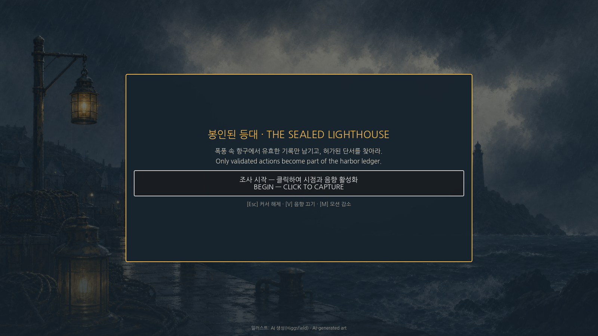

# The Sealed Lighthouse — Web release lane

Status: **public-safe artifact deployed at
[sealed-lighthouse-trace-rpg.vercel.app](https://sealed-lighthouse-trace-rpg.vercel.app); browser
smoke passed on 2026-08-17**.

This directory holds the reproducible *configuration* for a procedural-only Godot Web build. The
generated `public/` directory is intentionally ignored and is deployed as a static artifact after
local browser verification.

**The exported `index.pck` is not byte-reproducible.** Four consecutive Web exports from the same
clean clone, on one machine with one Godot build, produced four distinct digests and two distinct
sizes (1,573,408 and 1,573,424 bytes; a 16-byte swing). The `index.html` shipped alongside embeds
the observed pck size, so it varies with it, while `index.wasm` and the bundled font stay stable.
Godot's packer is the source of the variance, not the tracked tree or the build script.

Two consequences worth stating plainly. A pck digest recorded below is a **receipt for one specific
deployed artifact**, not a target a rebuild can be expected to hit; do not treat a mismatch as
evidence of tampering or drift. And release verification for this bundle rests on browser smoke
evidence plus the deterministic research artifacts, not on byte-equality of the pck.

The builder copies `game-track/godot/` to a disposable directory and selects `main_3d.tscn` only in
that copy. The canonical research project continues to launch `headless.tscn`, so the immutable
render-evidence binding to `project.godot` does not drift.

```bash
./scripts/build_godot_web.sh
```

The Web preset is single-threaded and has extension support disabled. It therefore does not require
cross-origin isolation. It includes the authored scenario JSON explicitly. Pending-review generated
concept images live outside `res://` and are not shipped; the public build uses the programmatic
presentation fallback.

The current ignored `public/` artifact contains 11 top-level files and 41,426,182 bytes, including
`index.html`, JavaScript/audio worklets, `index.pck`, `index.wasm`, and the directly readable
`NanumGothic-OFL.txt`. Artifact existence is release engineering evidence only. Local deploy
metadata written by `vercel link` (`.env.local`, `.vercel/`, a generated `.gitignore`) is not part
of the shipped artifact and is excluded from that count.

Browser smoke confirmed:

- production deployment `dpl_7DN4fLqmGa8DfKeiQamVrkXgpEoe` serves the 2026-08-17 latest-only
  public-safe artifact;
- all 11 shipped files returned `200`; WASM used `application/wasm` and the JS entry plus both
  audio worklets used `application/javascript`;
- `index.html`, `index.pck`, `index.wasm`, and `NanumGothic-OFL.txt` fetched from the alias were
  byte-identical to the locally verified build;
- the declared `X-Content-Type-Options`, `Referrer-Policy`, and `Permissions-Policy` headers were
  present on the served HTML.
- Korean glyphs rendered from the bundled OFL Nanum Gothic font.
- [`NanumGothic-OFL.txt`](https://sealed-lighthouse-trace-rpg.vercel.app/NanumGothic-OFL.txt)
  returned `200 text/plain`, 4,534 bytes, and SHA-256
  `eeacf16032901d0ed0456876ec77b8f0fda6b3fecec7d972f8543eb602e6c30f`.
- the deployed PCK is 1,573,408 bytes, has deployment-receipt SHA-256
  `af6cc93cdf1b6f53c735c62134c24c8ef0ed43de69035759f35e6fecbd20ec02`, and excludes
  `docs/latest/**` plus every pending concept pack;
- the start gate and in-game ledger remained readable at 1280×720 and 390×844;
- entering the game from the start gate advanced the HUD to `LOOK ACTIVE` and rendered the ledger;
- console and page-error counts were zero before and after entry.

Pointer lock is **not verified** for this deployment. Headless Chromium raised `pointerlockerror`
on a synthetic click, and a Playwriter-driven click in real Chrome produced no pointer-lock request
at all, so neither run is admissible evidence. `LOOK ACTIVE` in the HUD is the game's own state
label, not `document.pointerLockElement`, so it cannot stand in for the browser-level check.
Automation denial is not by itself evidence of a production defect; a human-gesture check is the
open item. Pointer lock, save/reload, representative warmed-frame/input measurements, and a
30-minute soak all remain open, so G6 stays `FIX`. G4, usability, immersion, affect, player
efficacy, and model efficacy remain unassessed.

| Desktop entry | Narrow in-game layout |
| --- | --- |
|  |  |
