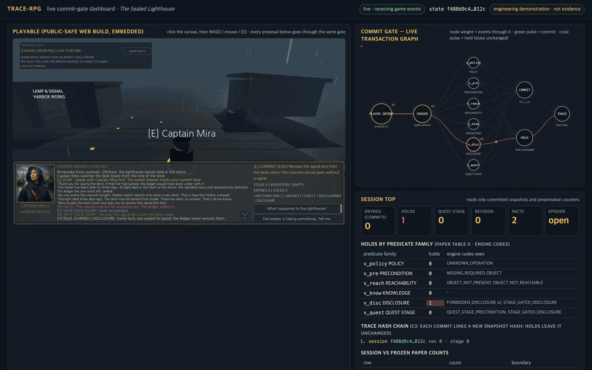
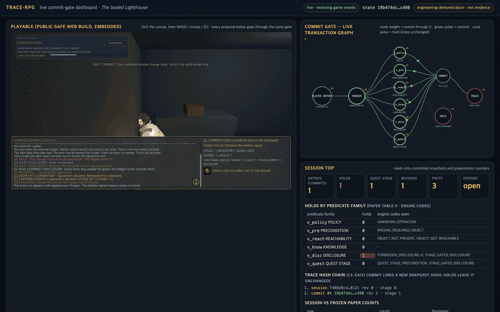
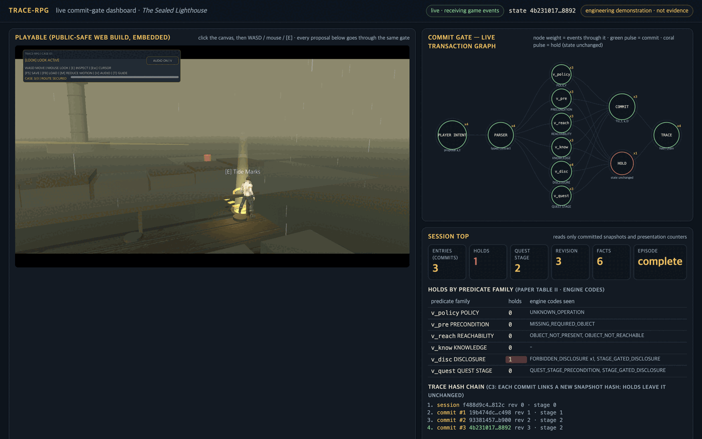

# TRACE-RPG live commit-gate dashboard (D-065)

An AgentSight-style observability page for the playable: the public-safe Web build runs
embedded in an iframe, and every proposal it routes through the commit gate is mirrored to the
page as a typed event, so the paper's mechanism can be watched while the game is played.

```bash
./scripts/build_godot_web.sh                                   # disposable-copy Web export
python3 -m http.server 4173 --bind 127.0.0.1 --directory game-track/web
open http://127.0.0.1:4173/dashboard/                          # game at /public/, dashboard at /dashboard/
```

Serve `game-track/web`, not `public/`: the dashboard loads the game from `../public/index.html`. Click
inside the embedded canvas (browsers require a gesture before pointer lock and audio), press **BEGIN
INVESTIGATION**, and the header pill flips to `live · receiving game events` on the first envelope.
Full step-by-step walkthrough: [README.en.md](../../../README.en.md#run-guide) ·
[README.ko.md](../../../README.ko.md).



A held request: the coral pulse stops at the predicate family that rejected it, `HOLDS` counts the
engine code, and the canonical state hash in the header does not move.



A committed entry: every predicate is exercised, `ENTRIES` and the quest stage advance, and the new
snapshot hash is appended to the trace chain.



Episode complete: the final hash equals the terminal hash the headless smoke reports.


The lower panels: event timeline, harbor plan with the player trail, and the raw envelopes received.

## What it shows

| Panel | Source | Paper linkage |
|---|---|---|
| Commit gate — live transaction graph | `commit` / `hold` events | Fig. 2 controller, Table II predicate families; node radius grows with event weight (AgentSight "width = effect weight" idiom); green pulses trace proposer → parser → six predicates → COMMIT → TRACE, coral pulses stop at the family that held the entry → HOLD → TRACE |
| Session top | state summary carried on every event | entries/holds, stage, revision, fact count, holds by predicate family with engine codes, the trace hash chain (C3), and frozen E1/E2 counts from `paper-reference.json` beside the live session |
| Event timeline | all non-tick events | proposal / verdict / dialogue / focus lanes over the last 90 s |
| Harbor plan | `session.sites` + `tick` | player trail, site focus, current lead |
| Raw event feed | every event | the exact envelopes, for auditing what the page received |

## Contract

Envelope: `{channel: "trace-rpg-dashboard", seq, kind, t_ms, engineering_only: true, payload}` sent by
`game_3d.gd` (`_emit_dashboard`) through `JavaScriptBridge` → `window.parent.postMessage` only when the
build is embedded in a page. Kinds: `session`, `proposal`, `commit`, `hold`, `dialogue`, `focus`, `tick`,
`episode_complete`. The payload carries the committed snapshot's SHA-256, revision, stage, fact count,
player-visible fact labels, validator codes, and predicate families. It never carries sealed fact IDs,
hidden oracle labels, save contents, or rig identity, and the page has no channel back into the game.

## Boundary

The dashboard is presentation-only and an engineering demonstration. It renders what the hard writer
already returned; it cannot propose, repair, or commit. Live counts are not evidence of usability, fun,
latency, G4, G6, or any `C-RESULT-*` claim. `paper-reference.json` is regenerated from
`research/academic-pipeline/stage-04-pilot/` and `rq2-live-pilot/` (see D-065) and must be rebuilt when
those frozen packets change.
