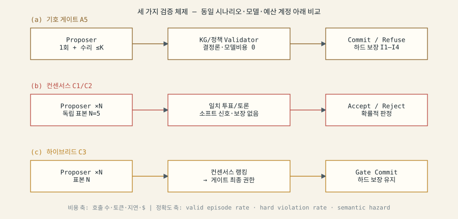
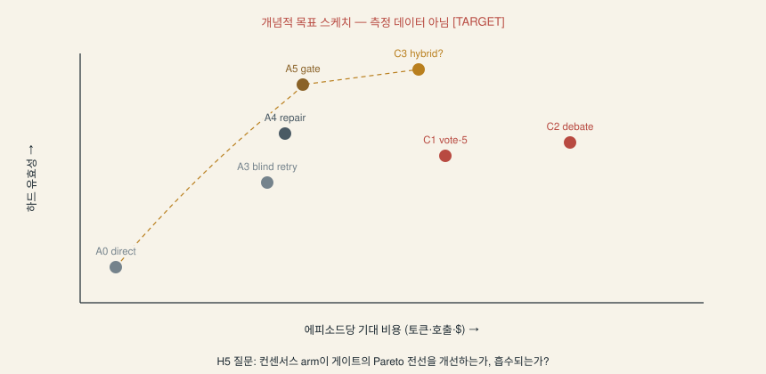

# 연구방향: 컨센서스 대 기호 커밋 게이트 — 비용·정확도 정량 비교

```yaml
direction_id: SL-DIR-001
status: PROPOSED-NOT-REGISTERED
run_id: 20260814-consensus-gate-direction
depends_on: [SL-ORACLE-001, configs/experiment-matrix.yaml, knowledge/ OKF bundle]
claim_scope: 설계 제안 문서 — 어떤 실험 결과도 주장하지 않음
```

## 1. 논제 — 지식그래프 관계와 뉴로심볼릭 술어의 구조 동형성

지식그래프의 타입 엣지 `(head, relation, tail)`과 그 위의 제약(도메인/레인지, 카디널리티,
경로 조건)은 TRACE-RPG validator의 상태 상대 술어와 **같은 선언적 형태**를 가진다:

| KG 구성물 | TRACE-RPG 술어 | 공통 형식 |
|---|---|---|
| 타입 엣지 도메인/레인지 | action policy (`v_policy`) | 관계가 성립 가능한 타입 조건 |
| 경로 도달 가능성 | reachability (`v_reach`) | 그래프 상 경로 존재 |
| 노드 속성 전제 | precondition (`v_pre`) | 상태 필드 조건 |
| 에이전트-지식 부분그래프 | NPC knowledge (`v_know`) | 지식 투영 포함 여부 |
| 접근 제어 엣지 레이블 | disclosure (`v_disc`) | 허가 술어 |
| 순서 제약 (DAG) | quest stage (`v_quest`) | 부분 순서 위반 금지 |

이 동형성은 OKF 방법 번들(`knowledge/`)의 링크 그래프가 이미 보여준 것과 같은 원리다:
**관계의 존재는 링크가, 관계의 의미는 술어(산문)가 진다.** 따라서 "KG를 잘 따르는 생성"과
"기호 게이트를 통과하는 생성"은 같은 질문의 두 표현이고, 남는 질문은 *검증 신호를 어디서
얻는가*이다 — 결정론적 술어 평가(비용 ≈ 0 모델 호출)인가, 모델 표본 간 일치(컨센서스,
비용 ∝ N 호출)인가.

## 2. 연구 질문 (제안 RQ6 / 대조 패밀리 H5)

> 동일 예산 계정 아래, 컨센서스 기반 검증(자기일관성 투표·다중 에이전트 토론)은
> 기호 커밋 게이트 대비 **비용-유효성 Pareto 전선**의 어디에 위치하는가?
> 하이브리드(컨센서스 랭킹 + 게이트 최종 권한)는 전선을 개선하는가?

- **H5a (비용 우위)**: 하드 유효성(valid episode rate, hard violation rate)에서 A5 게이트는
  컨센서스 C1(vote-N)·C2(debate) 대비 에피소드당 기대 비용(토큰·호출·지연)이 낮으면서
  유효성이 같거나 높다. 근거 직관: 게이트의 검증은 결정론적이며 모델 호출을 소비하지 않는다.
- **H5b (보완성)**: 선언 필드 밖 의미 오류(semantic hazards: 모순, 근거 없는 세계 사실)에서는
  컨센서스가 게이트가 놓치는 오류의 일부를 잡는다 — 게이트의 construct 한계
  ("인코딩된 검사는 누락된 의미를 발견할 수 없다")에 대한 정량화.
- **H5c (하이브리드)**: C3(컨센서스 랭킹 → 게이트 최종 권한)는 A5 대비 의미 오류율을 낮추면서
  하드 보장(I1–I4)을 유지하고, 추가 비용이 C1 단독보다 작다.

## 3. 실험 설계 확장 (기존 매트릭스에 추가 제안)

### 3.1 새 컨트롤러 arm (C-계열)

| arm | 절차 | 검증 신호 | 예산 계정 |
|---|---|---|---|
| C1 `consensus_vote_n` | 독립 표본 N=5 → 구조 동치류 다수결 | 표본 간 일치 (소프트) | N 호출 · 전체 토큰 |
| C2 `multiagent_debate_r` | 2 에이전트 × 2 라운드 토론 후 판정 | 토론 수렴 (소프트) | 2×R+1 호출 |
| C3 `consensus_then_gate` | 표본 N → 일치 상위 후보를 게이트에 제출 (수리 ≤K 유지) | 소프트 랭킹 + 하드 게이트 | N + (1+K) 호출 |

기존 A0–A5는 그대로 유지된다. C-계열은 A3/A4/A5와 **총 토큰 예산 매칭** 축을 추가한다
(기존 호출 수 매칭만으로는 표본 N의 토큰 비용이 가려짐). 이는 기존 설계의 평가방법 개선점:
비교를 "최대 호출 4회" 단일 축에서 "호출 × 토큰 × $" Pareto 보고로 확장한다.

### 3.2 지표 확장

- 기존 1차 종점 유지: valid episode rate · hard dialogue violation rate · tension RMSE.
- 추가 지표 **cost-of-valid-episode**: 유효 에피소드 1건당 기대 비용
  `E[cost] / P(valid)` — 정확도와 비용을 단일 스칼라로 접는 결정 지표(문헌의 cost-of-pass 형식).
- 의미 오류율: 의미 오라클 hazard_codes 기반 (블라인드 채점, 게이트/컨센서스 어느 쪽도
  자기 채점 금지 — 누출 방지 4항).

### 3.3 분석 계획 (H5)

- 혼합효과 로지스틱(기존 H1 구조 재사용: 템플릿 임의절편, 모델 고정층)으로 arm 대조.
- H5a: A5 vs C1·C2 — 유효성 비열등(기존 한계 2pp 재사용) + 비용 우월(양측 α=.05, Holm).
- H5b: 의미 오류율에서 C1 vs A5 우월 검정 (양측 α=.05).
- H5c: C3 vs A5 — 의미 오류율 우월 + 하드 유효성 동일성 확인 + 비용 증가량 보고.
- Pareto 전선은 추정치·95% CI와 함께 기술 보고(전선 자체에 검정 없음).
- 실패·결측은 기존 treatment-policy 그대로: timeout/파싱 실패 = adapter failure,
  컨센서스 불일치(과반 미달) = 신규 종단 클래스 `consensus_deadlock`으로 보존.

### 3.4 게임 트랙 배선

*봉인된 등대* 슬라이스에는 이미 세 체제의 배선 증거가 있다 [OBSERVED — 엔지니어링]:
게이트(정책 미러 + 스모크 10검사), 수리 루프(LLM 채널 K=3, A4 미러), 프로바이더 왕복
(gpt-5.4, 2,994 ms). C1은 동일 프로바이더의 N-표본 호출로, C3는 표본 → 채널 검증 경로
재사용으로 구현 가능하다. 단, 확증 실행은 SL-DEV-001이 아닌 동결 템플릿 모집단에서 한다.





## 4. 근거 문헌 (딥리서치 검증 결과, 2026-08-14)

39편 검증(1차 소스 + DBLP/프로시딩 교차; UNVERIFIED 0, venue 캐비앳 플래그만 존재).
전체 목록·수치·검증 URL: [`lit/consensus-literature.md`](lit/consensus-literature.md) ·
[`lit/neurosymbolic-kg-literature.md`](lit/neurosymbolic-kg-literature.md) ·
[`lit/cost-evaluation-literature.md`](lit/cost-evaluation-literature.md).

### H5a를 지지하는 근거 (게이트의 비용 우위)

- **컨센서스의 비용 상한은 구조적**: Vote/Filter-Vote 정확도는 호출 수에 비단조 — 상승 후
  하락 (Chen et al., NeurIPS 2024); 자동 검증기 없는 도메인에서 다수결·RM 선택은 수백 표본에서
  정체 (Brown et al., ICLR 2025). Cost-of-Pass (ICLR 2026)는 majority voting류의 한계 이득이
  "비용을 정당화하기 어렵다"고 판정 — **우리의 귀무가설**.
- **기호 검증은 표본 배수 없이 이긴 선례**: Logic-LM (Findings EMNLP 2023) CoT 대비 +18.4%p,
  1회 번역 + 결정론 솔버; SatLM (NeurIPS 2023)은 파싱된 명세에 대한 정답 *보장*;
  PANGeA (AIIDE 2024)는 검증 계층으로 Llama-3 8B를 28%→98%로 — 검증 계층이 모델 스케일을
  이긴다.

### H5b를 지지하는 근거 (컨센서스의 보완성)

- 토론 3×2 후에도 체스 수 무효 54.8% 잔존 (Du et al., ICML 2024) — 소프트 방법 단독의 한계.
  역으로 LINC (EMNLP 2023)는 FOLIO/GPT-4에서 기호 경로가 CoT에 밀리는 **상보적 실패 모드**를
  보고 — 어느 쪽도 전역 지배가 아니다.
- IVIE (ICCC'26)의 반례: 검증 전 단계를 통과한 세계 2건이 구조적으로 불가능(스키마 공백) —
  **validator는 인코딩한 술어만 강제한다**. 선언 필드 밖 오류는 컨센서스/의미 오라클의 몫.
- 게이트 위양성률이 컨센서스 이득의 상한 (Stroebl et al., arXiv:2411.17501) — H5b 결과에
  게이트 위양성률 병기 보고 필수.

### H5c와 평가방법을 지지하는 근거

- 예산 매칭 비교의 정당성: isoFLOP 선례 (Hoffmann, NeurIPS 2022) · FLOPs 매칭 테스트타임
  (Snell, ICLR 2025 Oral). 비용 통제 없는 정확도 승리는 방법 우월의 근거가 아니다
  (Kapoor et al. "AI Agents That Matter", arXiv:2407.01502) — Pareto 곡선 보고 관례 채택.
- 비용은 벡터로: 단일 지표는 순위를 뒤집는다 (Dehghani "Efficiency Misnomer", ICLR 2022);
  HELM (TMLR 2023) idealized/denoised 런타임 구분; 호스티드 API 지연 보정 (Narayanan,
  NeurIPS 2023). 에스컬레이션 비율 보고는 RouteLLM (ICLR 2025) 관례.
- 통계: 쌍대·클러스터 SE·검정력 계획 (Miller, arXiv:2411.00640) + IQM·층화 부트스트랩
  (Agarwal, NeurIPS 2021 = 기존 S31) + 전 무작위 원천 랜덤화 (Bouthillier, MLSys 2021).
- 소형 모델 패널이 대형 저지보다 7× 저렴한 반례 (Verga PoLL, arXiv:2404.18796) —
  게이트 논거는 가격이 아니라 **보장 유형**(결정론적 술어 vs 확률적 일치)에 세운다.
  소프트 저지의 상한은 인간 일치 ~80% (Zheng, NeurIPS 2023 D&B).

### KG–술어 동형성의 실증 근거

- G-Retriever (NeurIPS 2024): 유효 엣지 12%→76%, 완전 유효 그래프 8%→62% — 그래프 구조
  자체가 측정 가능한 유효성 지표. PICARD (EMNLP 2021) 무효 12%→2% — 디코딩 중 거부.
  Geng (EMNLP 2023) 입력 의존 문법 = 세계 상태에서 술어를 끌어오는 validator의 형식 유사체.
  Sabre (AIIDE 2021 — ToG 아님, 인용 교정) 절제 실험: 제약 계층 제거는 품질 저하가 아니라
  **무효 플랜 110개 수용** — 제약은 해공간의 구성 요소.

## 5. 경계와 정직성

- 본 문서는 **제안**이다. experiment-matrix.yaml에 등록되지 않았고, 사전등록·동결 전에는
  어떤 H5 결과도 주장할 수 없다.
- 컨센서스 arm은 하드 보장(I1–I4)을 제공하지 않는다 — C1/C2의 "수락"은 확률적 판정이며,
  정식 상태 권한은 어떤 설계에서도 게이트가 소유한다(C3 포함).
- 개념 Pareto 스케치는 측정이 아니다 [TARGET].
